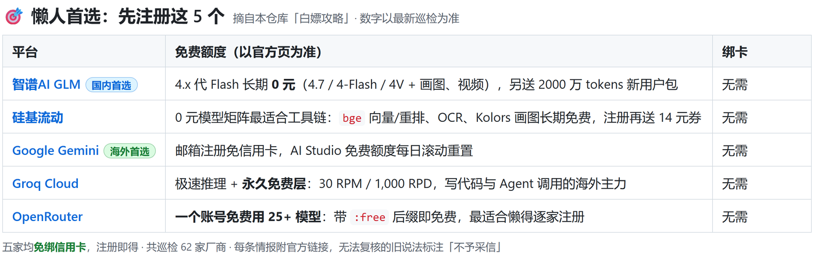

# Free LLM Intel · LLM 免费额度与活动情报

> 国内外 **62 家** LLM 厂商免费 API 额度、永久免费模型与限时活动的**可复现巡检库**：
> 不提供、不分发任何 API Key；所有数字均来自巡检脚本对**官方页面**的实时抓取，每条情报附官方链接，
> 无法在官方页复核的旧说法一律标注「不予采信」。

[](LICENSE) [](https://github.com/rockbenben/365opensource)

- 🎯 不知道先注册谁？直接看下文「[白嫖攻略](#白嫖攻略)」
- ⚡ 客户端一键接入？直达「[OpenAI 兼容端点速查表](#一键接入)」
- 📊 免费额度总表见文末自动生成的 **Part 1–3**
- 📡 厂商博客 / 更新动态：[llm-news-feeds.md](llm-news-feeds.md)（主文档每家最新 5 篇），每厂商全量归档在 [`llm-news/`](llm-news/)；RSS 订阅清单：[llm-news-feeds.opml](llm-news-feeds.opml)（含**官方原生源 + 自建源**两组，一次导入全部订上）
- 📻 自建 RSS（官方没有原生订阅源的厂商也能订）：[网页浏览 / 一键订阅](https://free-llm-intel.aishort.top/)（页面顶部显示**当前订阅地址**，可直接复制）｜ [合并流（聚合全部有动态源的厂商）](https://free-llm-intel.aishort.top/feeds/llm-news-all.xml) ｜ 单厂商源 `https://free-llm-intel.aishort.top/feeds/llm-news-<厂商 id>.xml`
- 🤖 自己跑巡检 / 二次开发：`pip install -r requirements.txt && python crawler_llm_intel.py`（详见[快速开始](#快速开始)）



<!-- LLM-GUIDE:BEGIN  本章节由 crawler_llm_intel.py 自动生成，请勿手工修改 -->
---

<a id="白嫖攻略"></a>

## 🎯 白嫖攻略

> 本章节与下方厂商总表同源，每次巡检自动重建；免费政策随时变化（活动到期、限速调整、模型下架），注册 / 充值前请点进对应厂商的官方链接复核。

### 0. 懒人首选：不知道选谁，先注册这 5 个

> 五家都**免绑信用卡**，注册即得（国内的需手机号实名，海外的邮箱即可——都属常规注册）；覆盖日常对话、写代码、向量/重排、画图等绝大多数免费用法。

1. [智谱AI GLM](#2-智谱ai-glm-大模型开放平台) —— **4.x 代 Flash 长期 0 元**（4.7/4-Flash/4V + 画图/视频），国内中文场景首选；但新旗舰 5.3-Flash 已收费，免费模型有独立并发限速
2. [硅基流动](#8-硅基流动-siliconflow) —— 0 元模型矩阵最适合工具链：bge 向量/重排、OCR、Kolors 画图长期免费，注册再送 14 元券试旗舰
3. [Google Gemini](#26-google-gemini-google-ai-studio) —— **邮箱注册免信用卡**，免费额度每日滚动重置；Gemini Flash 旗舰能力，海外平台首选
4. [Groq Cloud](#28-groq-cloud-lpu-推理) —— 极速推理 + **无需付款方式的永久免费层**：30 RPM / 1,000 RPD，写代码与 Agent 调用的海外主力
5. [OpenRouter](#34-openrouter-模型统一网关) —— **一个账号免费用 25+ 模型**：带 `:free` 后缀即免费、无需付款方式，最适合懒得逐家注册

### 1. 先认清四类「免费」——按能否白嫖排序

> 排序逻辑是**新用户视角**：先看要不要绑卡（实名 / 邮箱都只是常规注册，不算门槛），再看额度会不会过期。A 类注册即用且不会过期，C 类额度最大但要先冒绑卡的风险。

| 类型 | 特点与正确用法 | 代表平台（点击跳上方档案） |
|---|---|---|
| **A. 无条件 · 长期可用** | 注册即得（邮箱 / GitHub / Google 或手机号实名均可，**无需付款方式**），不过期或按日/月滚动重置；可当长期主力，注意 RPM/RPD 限速与商用条款 | 国内：[智谱AI GLM](#2-智谱ai-glm-大模型开放平台)（4.x 代 Flash 0 元（新旗舰 5.3 付费）+ 2000 万 tokens 新用户包）、[商汤日日新](#7-商汤日日新-sensenova-大装置)（Token Plan 公测：每 5 小时 6 万积分）、[硅基流动](#8-硅基流动-siliconflow)（bge/OCR/画图等 0 元模型 + 注册送 14 元券）、[科大讯飞星火](#20-科大讯飞星火-spark-api)（星火 Lite 支持免费使用（需产品页领取））<br>海外：[Google Gemini](#26-google-gemini-google-ai-studio)（AI Studio：Gemini 3.x Flash 全系免费层）、[Groq Cloud](#28-groq-cloud-lpu-推理)（gpt-oss 免费层 30 RPM / 1,000 RPD）、[Mistral AI](#29-mistral-ai)（免费**端点**：Mistral Moderation 2（Free）+ Labs 实验模型（无新用户赠金））、[Cohere](#30-cohere)（Trial Key 免费（每月 1,000 次，限非商用））、[Hugging Face](#32-hugging-face-inference-providers)（Inference Providers 每月 $0.10）、[Cloudflare Workers AI](#33-cloudflare-workers-ai)（86 个模型共享每日 1 万 Neurons）、[OpenRouter](#34-openrouter-模型统一网关)（:free 模型 20 RPM / 50 RPD（充值 $10 升至 1,000 RPD））、[Jina AI](#42-jina-ai-reader-embeddings-reranker)（每 Key 1,000 万 tokens，GitHub 登录免卡）、[Poolside](#43-poolside)（代码模型限时免费（官方未公布截止日））、[Morph Labs](#44-morph-labs)（每月 200 次请求 + 工具附带 $10/月算力）、[Relace](#45-relace)（编程 Agent 专用模型免费套餐）、[Mancer](#46-mancer)（页面标 FREE 的角色扮演向模型 0 元调用）、[NVIDIA NIM](#47-nvidia-nim-api-catalog)（免费推理约 40 RPM，不按 token 计费）、[无问芯穹 Infini AI](#53-无问芯穹-infini-ai-genstudio)（嵌入 / 重排接口长期免费 + 网页 Playground 全模型免费体验）、[IBM watsonx.ai](#57-ibm-watsonxai-free-toolbox)（Free Toolbox/Lite 免卡：30 万 tokens + 20 CUH/月）、[Modal](#59-modal-serverless-ai-云平台)（$30 / 月免费算力，按月重置）、[Modular](#61-modular-原-bentocloudbentoml)（共享端点免费测试 + 开源自托管永久免费） |
| **B. 无条件 · 一次性限时** | 注册即到账、**无需付款方式**，但有有效期、不可重置；先想好用量再开通，薅完即走 | 国内：[阿里云百炼](#3-阿里云百炼-model-studio-通义千问)（每模型 100 万 tokens / 90 天）、[百度智能云千帆大模型平台](#5-百度智能云千帆大模型平台)（17 个模型各 100 万 / 3 个月 + 20 元券）、[腾讯云混元](#6-腾讯云混元-tokenhub)（Hunyuan-a13b 与 embedding 各 100 万）、[Kimi 开放平台](#10-kimi-开放平台-月之暗面)（实名送 15 元代金券（可抵 kimi-k3，上下文 1,048,576））、[美团 LongCat](#12-美团-longcat-长猫开放平台)（LongCat-2.0 资源包（1M 上下文，30 天有效））、[StreamLake](#13-streamlake-快手万擎)（注册开通后分批送免费调用次数（仅基础模型推理））、[中国电信](#14-中国电信-天翼云-息壤智算)（实名最高 2,000 元试用体验金）、[数眼智能](#16-数眼智能-数言-ai-shuyanai)（注册即领 50 万 tokens（第三方中转，注意风险））、[云知声 Token Hub](#18-云知声-token-hub-maas)（OCR/U2 各 500 万、ASR 5 小时、TTS 5 万字）<br>海外：[Fireworks AI](#37-fireworks-ai)（新号 $1 免费额度）、[Stability AI](#40-stability-ai)（新号 25 积分；开源权重年营收 < $100 万免费）、[AI21 Labs](#41-ai21-labs)（$10 credits，邮箱注册免卡）、[InceptionLabs](#50-inceptionlabs)（新号 1 亿 free tokens，免信用卡）、[Baseten](#60-baseten)（新账户试用额度（官方未公开金额，以控制台为准）） |
| **C. 需绑卡 · 大额云试用金** | 需信用卡或身份验证（可能有验证扣款）；额度最大，但**注册后立刻设预算告警**，记下到期日并主动关停 | 海外：[Cerebras Inference](#35-cerebras-inference-晶圆级推理)（$5 赠金 / 30 天（需添加付款方式后发放））、[Nebius](#36-nebius-token-factory-ai-cloud)（无自动赠送；绑卡扣 $25 且转为余额，并非赠金）、[Anyscale](#48-anyscale)（$100 注册额度（需工作邮箱；无独立免费层，抵扣 Ray 算力））、[Amazon Bedrock](#54-amazon-bedrock-aws-free-tier)（$100 起，6 个月内最高 $300（需信用卡））、[Azure OpenAI / Azure AI Foundry](#55-azure-openai-azure-ai-foundry)（$200 / 30 天（需信用卡或身份验证））、[Google Cloud Vertex AI](#56-google-cloud-vertex-ai)（$300 / 90 天 + Always Free（需绑卡））、[Oracle OCI Generative AI](#58-oracle-oci-generative-ai)（$300 / 30 天 + Always Free（需信用卡验证））、[DigitalOcean Inference Engine](#62-digitalocean-inference-engine)（$5 / 90 天通用试用金（非 LLM 免费层，需绑卡）） |
| **D. 开源权重 / 自托管** | 没有「额度」概念，自己出算力；也可走 A 类平台免费托管调用 | 海外：[Meta Llama](#31-meta-llama-开源权重)（Llama 4 Scout/Maverick 免版税权重（可经 Groq/Cloudflare 免费托管调用））、[Stability AI](#40-stability-ai)（新号 25 积分；开源权重年营收 < $100 万免费）、[Modular](#61-modular-原-bentocloudbentoml)（共享端点免费测试 + 开源自托管永久免费） |

### 2. 唯一的真门槛：要不要信用卡

- 除下列 **8 家需验证付款方式**外，其余平台注册即发 Key，无任何付款门槛；国内平台用手机号 + 实名（常规注册，人人可办），海外平台用邮箱 / GitHub / Google 登录。
- ⚠️ **需绑卡**（可能有验证扣款或最低首付，赠金到账后也请立即设预算告警）：[Cerebras Inference](#35-cerebras-inference-晶圆级推理)、[Nebius](#36-nebius-token-factory-ai-cloud)、[Anyscale](#48-anyscale)、[Amazon Bedrock](#54-amazon-bedrock-aws-free-tier)、[Azure OpenAI / Azure AI Foundry](#55-azure-openai-azure-ai-foundry)、[Google Cloud Vertex AI](#56-google-cloud-vertex-ai)、[Oracle OCI Generative AI](#58-oracle-oci-generative-ai)、[DigitalOcean Inference Engine](#62-digitalocean-inference-engine)。
- 国内平台未完成实名时可能被限速（如 PPIO），但这是注册流程的一部分，不是额外门槛。

### 3. 按场景选

- **写代码 / 编程 Agent**：[智谱AI GLM](#2-智谱ai-glm-大模型开放平台)（4.x 代 Flash 0 元（新旗舰 5.3 付费）+ 2000 万 tokens 新用户包）、[StreamLake](#13-streamlake-快手万擎)（注册开通后分批送免费调用次数（仅基础模型推理））、[Groq Cloud](#28-groq-cloud-lpu-推理)（gpt-oss 免费层 30 RPM / 1,000 RPD）、[Cloudflare Workers AI](#33-cloudflare-workers-ai)（86 个模型共享每日 1 万 Neurons）、[OpenRouter](#34-openrouter-模型统一网关)（:free 模型 20 RPM / 50 RPD（充值 $10 升至 1,000 RPD））、[Poolside](#43-poolside)（代码模型限时免费（官方未公布截止日））、[Relace](#45-relace)（编程 Agent 专用模型免费套餐）。
- **免费体验旗舰通用模型**：[阿里云百炼](#3-阿里云百炼-model-studio-通义千问)（每模型 100 万 tokens / 90 天）、[百度智能云千帆大模型平台](#5-百度智能云千帆大模型平台)（17 个模型各 100 万 / 3 个月 + 20 元券）、[Google Gemini](#26-google-gemini-google-ai-studio)（AI Studio：Gemini 3.x Flash 全系免费层）。
- **超长上下文（约 1M tokens）**：[Kimi 开放平台](#10-kimi-开放平台-月之暗面)（实名送 15 元代金券（可抵 kimi-k3，上下文 1,048,576））、[美团 LongCat](#12-美团-longcat-长猫开放平台)（LongCat-2.0 资源包（1M 上下文，30 天有效））。
- **图像 / 视频生成**：[智谱AI GLM](#2-智谱ai-glm-大模型开放平台)（4.x 代 Flash 0 元（新旗舰 5.3 付费）+ 2000 万 tokens 新用户包）、[Stability AI](#40-stability-ai)（新号 25 积分；开源权重年营收 < $100 万免费）。
- **Embedding / Rerank / OCR / 语音**：[腾讯云混元](#6-腾讯云混元-tokenhub)（Hunyuan-a13b 与 embedding 各 100 万）、[硅基流动](#8-硅基流动-siliconflow)（bge/OCR/画图等 0 元模型 + 注册送 14 元券）、[云知声 Token Hub](#18-云知声-token-hub-maas)（OCR/U2 各 500 万、ASR 5 小时、TTS 5 万字）、[Jina AI](#42-jina-ai-reader-embeddings-reranker)（每 Key 1,000 万 tokens，GitHub 登录免卡）、[无问芯穹 Infini AI](#53-无问芯穹-infini-ai-genstudio)（嵌入 / 重排接口长期免费 + 网页 Playground 全模型免费体验）。
- **自建私有端点 / 跑任意开源模型**：[Modal](#59-modal-serverless-ai-云平台)（$30 / 月免费算力，按月重置）、[Baseten](#60-baseten)（新账户试用额度（官方未公开金额，以控制台为准））、[Modular](#61-modular-原-bentocloudbentoml)（共享端点免费测试 + 开源自托管永久免费）。
- **邀请返利 / 拉新奖励**：[智谱AI GLM](#2-智谱ai-glm-大模型开放平台)（4.x 代 Flash 0 元（新旗舰 5.3 付费）+ 2000 万 tokens 新用户包）、[美团 LongCat](#12-美团-longcat-长猫开放平台)（LongCat-2.0 资源包（1M 上下文，30 天有效））。
- **学生 / 高校师生扶持**：[智谱AI GLM](#2-智谱ai-glm-大模型开放平台)（4.x 代 Flash 0 元（新旗舰 5.3 付费）+ 2000 万 tokens 新用户包）。
- **大额云厂商体验金（海外需绑卡，国内需实名）**：[中国电信](#14-中国电信-天翼云-息壤智算)（实名最高 2,000 元试用体验金）、[Amazon Bedrock](#54-amazon-bedrock-aws-free-tier)（$100 起，6 个月内最高 $300（需信用卡））、[Azure OpenAI / Azure AI Foundry](#55-azure-openai-azure-ai-foundry)（$200 / 30 天（需信用卡或身份验证））、[Google Cloud Vertex AI](#56-google-cloud-vertex-ai)（$300 / 90 天 + Always Free（需绑卡））、[Oracle OCI Generative AI](#58-oracle-oci-generative-ai)（$300 / 30 天 + Always Free（需信用卡验证））、[DigitalOcean Inference Engine](#62-digitalocean-inference-engine)（$5 / 90 天通用试用金（非 LLM 免费层，需绑卡））。

### 4. 防扣费清单（白嫖最容易翻车的地方）

1. [智谱AI GLM](#2-智谱ai-glm-大模型开放平台)：0 元只限 4.x 代，GLM-5.3/5.3-Flash 要付费（2000 万资源包可抵）；免费模型会换代（旧版下线自动路由新版）；限速数值只在控制台显示。
2. [阿里云百炼](#3-阿里云百炼-model-studio-通义千问)：开通模型时勾选「免费额度用完即停」；免费额度仅限北京区域，跨区域调用不扣免费额度。
3. [火山引擎](#4-火山引擎-火山方舟-豆包)：在控制台开启「安心体验模式」，超限即停，避免自动扣费。
4. [PPIO 派欧云](#11-ppio-派欧云-分布式大模型算力)：未实名认证用户有请求频率限制；历史“注册送 5 元”说法官方页无据。
5. [StreamLake](#13-streamlake-快手万擎)：免费额度**分批发放**（初识/探索/首金礼包）、**仅限基础模型推理**、**不可抵扣 Batch 批量推理**，具体额度以活动说明为准 ——「Air 永久免费」与「Pro 送 2000 万 tokens/30 天」均无官方依据，不予采信。
6. [Groq Cloud](#28-groq-cloud-lpu-推理)：旧 Llama-3.1-8b / 3.3-70b 已转 Enterprise 付费，勿按旧清单调用。
7. [Mistral AI](#29-mistral-ai)：免费的是**端点**而非额度：无新用户赠金 / 免费实验层；`Leanstral` 属 Labs 限时收集反馈期，随时可能下线；商业模型（Medium 3.5 / Large 3 / Small 4 等）均按量付费；旧「€5 赠金 / 1 RPS 免费层」在现行定价页无据。
8. [Cohere](#30-cohere)：Trial Key 明确仅限非商业用途，商用需升级付费套餐。
9. [Cloudflare Workers AI](#33-cloudflare-workers-ai)：超量按 $0.011 / 1,000 Neurons 计费，注意每日用量。
10. [OpenRouter](#34-openrouter-模型统一网关)：只有带 :free 后缀的模型免费；同名付费模型会按量扣费。
11. [NVIDIA NIM](#47-nvidia-nim-api-catalog)：免费接口面向开发评估，不可用于生产环境。
12. [无问芯穹 Infini AI](#53-无问芯穹-infini-ai-genstudio)：免费的是**嵌入 / 重排接口**与**网页体验**；GenStudio **API 推理不设试用额度**、按量付费（官方计费文档已明确），「注册送 200 万 token」是旧说法，不予采信。
13. [Baseten](#60-baseten)：试用额度**金额未公开**，以注册后控制台显示为准；Startup Program（最高 $25,000 算力 + $2,500 Model APIs）需申请审核，非注册即得。
14. 所有绑卡平台（见第 2 节名单）注册后立刻设置 **Budget 预算与用量告警**，记下赠金到期日，到期前关停资源、删除计费实例。
15. 永久免费层 RPM 普遍只有个位数到几十，批量任务请走大额试用金 / 月度重置额度或错峰。
16. 第三方聚合中转（DMXAPI、数眼智能等非官方平台）存在跑路风险，只放低敏测试流量，不要充大额余额。

### 5. 限时 / 易变信息（最容易过期，看到请先核对官方页）

- [摩尔线程 MUSA Coding Plan](#21-摩尔线程-musa-coding-plan)：Free Trial 即左栏 30 天免费试用（每日限量 100 名），无独立注册赠金
- [Mistral AI](#29-mistral-ai)：Leanstral（Labs，labs-leanstral-2603，限时开放收集反馈）—— 免费端点
- [Poolside](#43-poolside)：已从申请制转为开放注册，官方标注 “Free to use for a limited time”（限时免费，截止时间未公布，以官方后续公告为准）

### 6. 免费额度用完之后

国内厂商的包月「编程套餐」（火山方舟 Coding Plan、智谱 GLM 套餐等）价格与档位调整频繁，本仓库不转抄未经本轮官方页核实的价格数字——请从上方对应厂商表格的「官方直达」进入定价页查看现行档位。挑选时重点对比三点：

1. **计费方式**：按请求次数（低频友好）还是按 token（长上下文 / 重度使用友好）；
2. **限速与并发**：套餐是否仍保留 RPM 上限，Batch / 夜间折扣是否可用；
3. **工具兼容**：是否支持你在用的 IDE / Agent 与 OpenAI 兼容端点。

<a id="一键接入"></a>

### 7. 常见免费 API · OpenAI 兼容端点与申请直达（一键接入）

> 适用于 NextChat、Cherry Studio、Chatbox、Dify、Cursor、Cline 等几乎所有支持自定义 OpenAI 格式的客户端：

| 平台名称 | 免费额度简述 | API Key 申请直达 | OpenAI 兼容 Base URL | 推荐填写的免费模型名称 |
|---|---|---|---|---|
| **智谱AI GLM** | 4.x 代 Flash 0 元（新旗舰 5.3-Flash 付费）+ 2000万券 | [控制台申请](https://bigmodel.cn/usercenter/apikeys) | `https://open.bigmodel.cn/api/paas/v4` | `glm-4.7-flash`, `glm-4-flash-250414`, `glm-4v-flash` |
| **阿里云百炼** | 每模型 100 万 / 90 天（北京区） | [控制台申请](https://bailian.console.aliyun.com/?apiKey=1) | `https://dashscope.aliyuncs.com/compatible-mode/v1` | `qwen3.8-max`, `qwen-plus` |
| **百度智能云千帆大模型平台** | 17 个模型各 100 万 / 3 个月 | [控制台申请](https://console.bce.baidu.com/qianfan/overview) | `https://qianfan.baidubce.com/v2` | `ernie-5.0`, `ernie-4.5-turbo`, `ernie-x1.1` |
| **硅基流动** | 众多 0 元模型 + 注册送 14 元券 | [控制台申请](https://cloud.siliconflow.cn/account/ak) | `https://api.siliconflow.cn/v1` | `PaddleOCR-VL-1.5`, `bge-m3`, `Kolors` |
| **MiniMax** | 新用户 Token Plan 订阅/体验 | [控制台申请](https://platform.minimax.cn/console/access?tab=api-keys) | `https://api.minimax.chat/v1` | `MiniMax-M3`, `MiniMax-M2.7` |
| **Kimi 开放平台** | 实名送 15 元券（1M 长上下文） | [控制台申请](https://platform.kimi.com/console/api-keys) | `https://api.moonshot.cn/v1` | `kimi-k2.7-code`, `kimi-k2.6` |
| **Google Gemini** | 免费层每日滚动重置（免绑卡） | [AI Studio 申请](https://aistudio.google.com/apikey) | `https://generativelanguage.googleapis.com/v1beta/openai/` | `gemini-2.5-flash`, `gemini-3.8-flash` |
| **Groq Cloud** | 30 RPM / 1,000 RPD 高速推理（免绑卡） | [控制台申请](https://console.groq.com/keys) | `https://api.groq.com/openai/v1` | `openai/gpt-oss-120b`, `qwen/qwen3.6-27b` |
| **OpenRouter** | 20 RPM 免费层（免绑卡） | [控制台申请](https://openrouter.ai/keys) | `https://openrouter.ai/api/v1` | 选带 `:free` 后缀模型（如 `google/gemma-4-31b-it:free`、`nvidia/nemotron-3-super-120b:free`） |
| **InceptionLabs** | 新号 1 亿 free tokens，免信用卡 | [Dashboard 申请](https://platform.inceptionlabs.ai/dashboard/api-keys) | `https://api.inceptionlabs.ai/v1` | `mercury-2.5`, `mercury-2` |

<!-- LLM-GUIDE:END -->

## 快速开始

环境要求：Python 3.10+；依赖 `requests`、`PyYAML`、`playwright`（pip 包随 requirements 安装；浏览器内核用于 JS 渲染 / 403 页面兜底，未安装内核时自动降级为纯 HTTP 抓取并在报告中标注，GitHub Actions 已安装内核）。

```bash
pip install -r requirements.txt
# 可选（本地启用 JS 动态页面 / 403 页面的浏览器兜底）：playwright install chromium
python crawler_llm_intel.py
# Windows 终端若遇编码报错，CMD 执行：set PYTHONIOENCODING=utf-8 ；PowerShell 执行：$env:PYTHONIOENCODING="utf-8"

# 运行本地回归测试套件：
python -m unittest discover
```

常用参数：`--only <vendor_id>`（只巡检指定厂商，调试用，不覆盖全局 README）、`--no-news`（跳过博客 / RSS 归档）、`--no-browser`（禁用 playwright）、`--delay <秒>`（请求间隔，默认 0.3）、`--timeout <秒>`（超时，默认 20）、`--ai-review`（变化时调用 Google AI Studio 的 Gemini 做事实核查，详见「更新机制」）。

完整巡检约需 5–15 分钟（厂商数、深度抓取的页面数与各源抓取结果见文末自动生成区块的「核心特性」行；JS 空壳与 403 页面自动走浏览器兜底），结束后自动刷新 Part 1–3 表格、博客主文档与 `llm-news/` 归档。

> 想启用 `--ai-review`：到 [Google AI Studio](https://aistudio.google.com/apikey) 免费申请一个 API Key，设置环境变量 `GEMINI_API_KEY`（也兼容 `GOOGLE_API_KEY`）即可，默认模型 `gemini-3.8-flash`，可用 `AI_REVIEW_MODEL` 覆盖；无需安装任何额外软件。

## 仓库结构

| 文件 / 目录 | 角色 |
|---|---|
| `llm-intel.yaml` | **输入**：厂商清单与待巡检页面（爬虫只读不写） |
| `provider_profiles.py` | **输入**：62 家厂商的人工档案（免费模型与额度、前置条件、特惠活动，均附官方链接） |
| `crawler_llm_intel.py` | 巡检引擎：抓取官方页 → 快照比对 → 变化时调用 AI 核查 → 套用档案 → 生成全部 Markdown 产物 |
| `ai_review.py` | 变化触发的 LLM 核查（默认直连 **Google AI Studio 的 Gemini API**，可选 Anthropic）：阅读变化页面正文 + 当前档案，只输出带「页面原文逐字证据」的严格 JSON 补丁；证据无法在原文定位则整条拒绝（防幻觉） |
| `profile_overrides.json` | AI 核查产物：对人工档案的字段级补丁（含 `_evidence` 证据、`_summary` 变更说明），经 PR 审核后入库 |
| `llm-intel-state.json` | 各官方页的文本快照哈希，用于检测「页面是否真的变了」（随仓库提交） |
| `.github/workflows/` | GitHub Actions 自动化工作流：每日错峰巡检、事实变动开 PR 审核、新闻与快照原子更新 |
| `test_workflow_and_review.py` | 自动化回归测试套件：覆盖工作流合规性、补丁叠加、快照退避冷却与防抖机制 |
| `README.md` | **产物**：本文件。`LLM-GUIDE:BEGIN/END`（项目介绍后的白嫖攻略）与 `LLM-INTEL:BEGIN/END`（文末厂商总表）两个标记块全部由脚本生成；其余说明可人工编辑 |
| `llm-news-feeds.md` / `.opml` | **产物**：博客动态主文档（每家最新 5 篇 + 全量归档链接）与 RSS 订阅清单。OPML 分三组：**官方原生源**（官网自带 RSS 的厂商）／**自建源**（官网没有原生 RSS 的厂商，只收这些，不与原生源重复）／**聚合流**（订阅这一个即可覆盖全部有动态源的厂商）；`feeds_base` 推不出来（本地运行）时只写原生源那一组 |
| `llm-news/<vendor>.md` | **产物**：每个厂商一个文件，全量罗列该来源所有文章 |
| `docs/feeds/*.xml` | **产物**：自建 RSS 2.0 订阅源（`llm-news-all.xml` 合并流 + 每厂商单源），由 `docs/` 作为 GitHub Pages 发布目录对外提供，供 RSS 阅读器订阅**官方没有原生源的厂商** |
| `docs/feeds/vendors.json` | **产物**：厂商索引（id / 名称 / 单源地址 / 篇数 / 最新日期），供浏览页列出**全部**厂商的订阅入口——合并流只收**有日期**的条目，会漏掉「文章全无日期」的厂商（如整源都拿不到日期的官网），索引把这些补齐 |
| `docs/feeds/articles.json` | **产物**：**全量**文章索引（标题 / 链接 / 厂商 / 日期 / 原文标题），给浏览页用。当前 2600+ 条、约 520 KB —— 只有同条数合并流 XML 的**一半**（不带描述），免去 XML 解析，而且**标题不截断、还带原文标题**（feed 里为了列表可读截到 60 字） |
| `docs/index.html` | **页面**（人工维护，非巡检产物）：自建 RSS 的浏览页——读 `feeds/articles.json` 渲染成**全部**条目（可按厂商筛选、可搜索），顶部一键订阅、**选中某厂商时订阅地址自动切成该家的单源**；厂商清单取自 `feeds/vendors.json`（不硬编码，厂商增删不漂移）。索引缺失时退回解析 `feeds/llm-news-all.xml` 并注明，不会整页打不开。**页面不含任何数据，全靠打开时 fetch 产物**，所以 CI 跑完即自动是最新，无需重新生成 |
| `.translate_cache.json` | 运行缓存（已 gitignore）：标题翻译结果持久化，重跑只翻译新增条目 |
| `requirements.txt` | **配置**：Python 依赖项声明（`requests`、`PyYAML` 为必需；`playwright` pip 包随依赖安装，Chromium 内核本地可选装、CI 已装） |
| `CONTRIBUTING.md` | **文档**：贡献指南（新增厂商规范、单厂商调试与 AI 审核/回退操作指引） |
| `vendor_watchlist.md` | **线索池**（人工维护）：听说过但尚未在官方页复核的厂商清单，标注 ❌ 已排除 / ⚠️ 待复核 / ❓ 未考察，并写明晋升为正式条目需要满足的条件 |

## 更新机制

- **手动巡检 + AI 核查**：本地执行 `python crawler_llm_intel.py --ai-review`，检查 diff 后提交；事实核查默认直连 **Google AI Studio 的 Gemini API**（免费层 Key，在 [aistudio.google.com/apikey](https://aistudio.google.com/apikey) 申请，设到环境变量 `GEMINI_API_KEY`，兼容 `GOOGLE_API_KEY`）——
  - 检测到事实页文本变化时，Gemini 阅读该厂商变化页面正文 + 当前生效档案，输出带**页面原文逐字证据**的严格 JSON 补丁；证据通过闸门后写入 `profile_overrides.json` 并生成 `.ai-changed` 标记，随后开 PR 审核（命令见 [CONTRIBUTING.md](CONTRIBUTING.md)）；
  - 默认模型 `gemini-3.8-flash`，可用 `AI_REVIEW_MODEL` 钉死其他模型；后端由 `AI_REVIEW_BACKEND=auto|gemini|anthropic` 控制（默认 auto：有 `GEMINI_API_KEY` 走 Gemini，否则尝试 `ANTHROPIC_API_KEY` 直连 Anthropic）；
  - **免费层回退**（[pricing 页](https://ai.google.dev/pricing) 核实 8 个模型免费层均可用）：首选模型 404 / 免费层未开放时自动按 `gemini-3.8-flash → gemini-3.7-flash → gemini-3.6-flash → gemini-3.5-flash → gemini-2.5-flash → gemini-3.5-flash-lite → gemini-3.1-flash-lite → gemini-2.5-flash-lite` 回退（完整 Flash 系按新到旧、Lite 系垫底，不纳入 preview 模型）；遭遇 429 短期限流（RPM/TPM，按模型独立计量）按 `Retry-After` 以 5/10/20/40 秒指数退避，退避不缓解则换下一个备选模型；判定为当日额度 RPD 耗尽（太平洋时间午夜重置，按项目共享）、备选链全部限流或多个模型连续 5xx 时**立即停止本次所有 AI 调用**；Key 无效等 400/401/403 立即报错不消耗调用；连续 3 厂商失败触发熔断；单厂商核查另受 900s 墙钟预算约束；
  - **同一变化不会反复烧额度**：① AI 判 `changed=false` 后新哈希立即落库，同一份页面文本不再二次触发；② 单厂商核查持续失败时按 1/2/4/7 天指数冷却（日志 `[ai-cooldown]`，原因记录在 `llm-intel-state.json` 的 `ai_attempts/ai_retry_after/ai_last_error`），不再每天重试；③ 所有失败路径一律**保留旧快照**，事实字段不会被改写；
  - 未配置 Key 或网络不可用时：跳过 AI 核查并**保留旧快照**，该变化在下次巡检自动重试，事实字段不会被改写。
- **人工回退手段**：① 不认可 AI 更新就**关闭/不合并 PR**——AI 只能改 `profile_overrides.json`，从未触碰人工基线 `provider_profiles.py`；② 已合并的更新有问题，删除（或编辑）`profile_overrides.json` 中对应厂商的键即恢复人工基线，证据留痕在 `_evidence`；③ 想临时停用 AI：本地不带 `--ai-review` 运行，CI 删除 `GEMINI_API_KEY` Secret 后新闻更新照常、事实变化只标记不核查。
- **定时自动更新**：GitHub Actions（`.github/workflows/refresh-intel.yml`）默认**每天北京时间 11:19** 全量抓取（时段不是随便挑的：必须落在**北京 08:00–24:00**，否则 runner 的 UTC 日期会比北京早一天，国内厂商当天发的文章会被判为「未来日期」而丢日期；11:19 同时已过美国工作日结束点、避开整点排队、且 Gemini 额度桶是满的。改 cron 前请读 workflow 头部注释）：
  0. 抓取完成后先跑**产物与不变量校验**（除会删 `.ai-changed` 的 `TestCrawlerCleanup` 外的全部用例，测试集由 `ci_suite()` 按「全部 − 白名单」推导，新增用例自动纳入）——失败即拦住提交，不让坏产物进 main；
  1. 页面快照无变化 → 不写产物、零提交；
  2. 仅新闻 / 证据引文变化 → 机器人直接提交 main；
  3. 额度等事实页文本变化（快照 hash 改变）→ 用仓库 Secret **`GEMINI_API_KEY`** 调用 Gemini 核查。通过证据闸门后**提交拆两路与 PR 安全累加**：
     - 若远端已有未合并的 `ai/intel-update` 分支，会自动同步其补丁并在其上累加，防止多日连续变动相互覆盖；
     - **待审 PR 的补丁只能经该 PR 落地**：同步进工作区的未审核 overrides（及按其渲染的 README）若当天走直提路径（无新变化 / AI 判未变化 / 未配 Key），会先还原为 main HEAD，快照与新闻照常提交——未审核内容绝无后门绕过 PR；
     - 采用**先开 PR、成功后再直推快照与新闻至 main** 的安全顺序，避免因 PR 失败导致快照提前落盘而静默丢失事实变更；
     - 页面快照已随巡检同步更新至 main（关闭 PR 即不采纳，该页文本不再重复触发 AI；页面下次真正变动时重新核查）。
     - 未配置该 Secret 时脚本**保留旧快照不前进**，变化持续标记到下次巡检，新闻更新仍照常原子性提交 main。

  配置方法：
  1. **Settings → Secrets and variables → Actions** 添加 `GEMINI_API_KEY`（免费申请：https://aistudio.google.com/apikey ）；
  2. **Settings → Actions → General → Workflow permissions**：选择 **Read and write permissions**，并务必勾选 **Allow GitHub Actions to create and approve pull requests**（GitHub 默认关闭，必须开启方可自动开 PR）；
  3. 若 `main` 分支开启了 Branch Protection，需将 `github-actions[bot]` 设为允许直推或 bypass；
  4. 定时任务需 workflow 位于默认分支才会被 GitHub 调度；
  5. **Settings → Pages**：Source 选 **Deploy from a branch**，Branch 选 `main`、目录选 **`/docs`** —— 这是[自建 RSS 浏览页](https://free-llm-intel.aishort.top/)与订阅源的托管方式（`docs/.nojekyll` 已关闭 Jekyll，保证 XML 原样输出）。订阅地址按仓库自动推导，fork 后无需改代码；不配置则订阅地址 404，其余产物不受影响。
  6. （可选，**配了自定义域名才需要**）**Settings → Secrets and variables → Actions → Variables** 加一个 `FEEDS_BASE`，值填 `https://<你的域名>/feeds`。留空时订阅源地址按 `GITHUB_REPOSITORY` 推导为 `https://<owner>.github.io/<repo>/feeds`；配了自定义域名后，GitHub Pages 会把 github.io 上的请求 301 到自定义域名，于是 feed 自己声明的 `rel=self` 与 `<source url>` 会与浏览页顶部显示的地址不一致，且每个订阅多一跳。填上它即可让两者都指向规范地址。
- **可信度原则**：只采信官方页面且保留原文证据；查不到的旧额度 / 旧模型名显式标注「无法复核，不予采信」，不转述第三方说法。

## 新增 / 修正厂商

欢迎 PR，流程见 [CONTRIBUTING.md](CONTRIBUTING.md)：在 `llm-intel.yaml` 增加待巡检页面、在 `provider_profiles.py` 补全带官方链接的厂商档案，本地验证通过后提交（单厂商使用 `--only` 调试，提交前运行全量巡检生成完整文档，详见贡献指南）。

## 许可证

[MIT](LICENSE)。本仓库仅索引官方公开信息，不提供任何 API Key；免费政策可能随时调整，实际权益以厂商官方页面与控制台为准。

---

<!-- LLM-INTEL:BEGIN  本章节由 crawler_llm_intel.py 自动生成，请勿手工修改 -->

> 实时追踪国内外大语言模型（LLM）厂商官方公开的**免费 API 额度**、**永久免费模型**与**限时活动调用**情报。
> 本区块由 `crawler_llm_intel.py` 在**每次运行时**实时巡检官方页面生成（非人工编辑、非服务端持续监控），最近一次巡检：**2026-09-21 09:21:02**；本地手动运行与 GitHub Actions 定时刷新的方法见文首「快速开始 / 更新机制」。
>
> 💡 **核心特性**：覆盖 **62 家厂商**（深度抓取 **118 个情报页 + 28 个动态页**）；已借助 Google 公开翻译引擎将海外一手情报全面汉化；自动过滤页面抓取状态噪点，直接展示具体额度（Tokens/代金券/免费层）、可用模型、有效期与限制条件。
> 📡 **博客动态订阅**：各厂商官方技术博客与更新日志单独维护至 [`llm-news-feeds.md`](llm-news-feeds.md)（共 20 个厂商），可导入 [`llm-news-feeds.opml`](llm-news-feeds.opml) 至 RSS 阅读器跟踪官方动态。
> 📡 **自建 RSS**（官方没有原生订阅源的厂商也能订）：[网页浏览 / 一键订阅](https://free-llm-intel.aishort.top/) ｜ [合并流](https://free-llm-intel.aishort.top/feeds/llm-news-all.xml) ｜ 单厂商源 `https://free-llm-intel.aishort.top/feeds/llm-news-{vendor_id}.xml`。

---

## Part 1：国内主流大语言模型（免费额度与接入指南）

> 以下平台面向开发者与个人用户，注册/认证后可获得**实实在在的免费额度**或**永久免费调用模型**。

---

### 1. DeepSeek (深度求索)

| 字段 | 详情 |
|------|------|
| **平台名称** | [DeepSeek (深度求索)](https://www.deepseek.com/) |
| **免费模型与额度** | • **无免费模型层**，全量模型按量计费：`deepseek-flash`（DeepSeek-V4.1-Flash，支持图像理解与思考模式）、`deepseek-v4-pro`（DeepSeek-V4-Pro-0813）；上下文 1M（最大输出 384K）<br>• 峰谷定价（元/百万 tokens，高峰为工作日 9:00–12:00、14:00–18:00，空闲半价）：deepseek-flash 输出 8 高峰/4 空闲、缓存命中输入 0.04/0.02；deepseek-v4-pro 输出 27.0/13.5、缓存命中输入 0.30/0.15<br>• 旧模型名 `deepseek-v4-flash`、`deepseek-v4-flash-vision-exp` 对应模型已下线，调用自动由 DeepSeek-V4.1-Flash 提供服务并按 Flash 计费 |
| **注册福利 / 账户赠送** | **无公开赠送政策**：现行官方定价页与更新日志均无新用户赠送 token 政策（历史“500 万 tokens/30 天”无法复核，不予采信）；账户扣费顺序中存在“赠送余额”项，实际以注册后账户到账为准 |
| **额度有效期** | 以账户内余额标注为准 |
| **前置条件 / 限制** | 注册平台账号；按量计费，并发限制随账户充值等级（Tier）提升 |
| **邀请 / 特惠活动** | 实行**峰谷定价**（元/百万 tokens，高峰为工作日 9:00–12:00、14:00–18:00，空闲时段半价）：deepseek-flash 输出 8.0（高峰）/4.0（空闲），缓存命中 0.04/0.02；deepseek-v4-pro 输出 27.0/13.5，缓存命中 0.30/0.15。 |
| **实时巡检证据** | • 当充值余额与赠送余额同时存在时，优先扣减赠送余额。<br>• (3) 更多并发限制细节，请参考限速与隔离。 |
| **官方直达** | [定价文档（人民币峰谷价）](https://api-docs.deepseek.com/zh-cn/quick_start/pricing) ｜ [API Key 管理](https://platform.deepseek.com/api_keys) ｜ [更新日志](https://api-docs.deepseek.com/zh-cn/updates/) ｜ [API 平台](https://platform.deepseek.com/) |
| **特别说明** | V3/R1 时代价格（缓存 0.5 元、输出 8 元）已作废；官方无 RSS，更新见 updates 页。 |

### 2. 智谱AI GLM (大模型开放平台)

| 字段 | 详情 |
|------|------|
| **平台名称** | [智谱AI GLM (大模型开放平台)](https://bigmodel.cn/) |
| **免费模型与额度** | • **免费的是 4.x 代 Flash，不含 5.x 新旗舰**：`glm-4.7-flash`（30B 级、200K 上下文、Agentic Coding 强化；GLM-4.5-Flash 下线后自动路由至此）、`glm-4-flash-250414`（智谱首个免费大模型 API）、`glm-z1-flash`（推理）—— 0 元<br>• 视觉（4.x 代）：`glm-4v-flash`（首个免费图像理解模型）、`glm-4.6v-flash`、`glm-4.1v-thinking-flash` —— 0 元<br>• 多模态生成：`CogView-3-Flash`（图像）、`CogVideoX-Flash`（视频）—— 0 元<br>• **当前旗舰 `glm-5.3-flash`（1M 上下文、原生多模态）是付费模型**，定价为 GLM-5.3 的 1/10，免费层不覆盖；`glm-5.3` / `glm-5.2` 同为付费（可用 2000 万资源包抵扣） |
| **注册福利 / 账户赠送** | 新用户注册专享 **2000 万免费 Tokens 资源包 + 120 次图像/视频资源包**（官方定价页首页原文：“新用户注册得 2000 万 Tokens，新模型免费”）——资源包只能抵扣**付费模型**，免费模型另算；有效期以券面标注为准 |
| **额度有效期** | 免费模型长期 0 元但**会换代**：旧版下线后请求自动路由到新版（如 GLM-4.5-Flash 2026-01-30 下线后自动路由至 GLM-4.7-Flash），旧 model id 可能失效 |
| **前置条件 / 限制** | 注册并完成实名认证 |
| **免费层限制 / 注意事项** | • **版本代差**：0 元只覆盖 4.x 代，最新一代 5.x（GLM-5.3 / GLM-5.3-Flash）全部收费；想要最新模型只能用 2000 万资源包抵扣或付费<br>• **限速按模型独立设置且数值不公开**：官方速率限制文档未给统一 RPM/TPM 数值，需登录控制台「速率限制」页查看本账户额度；触发限流返回错误码 1302、平台过载返回 1305；可申请提并发（10 个工作日审核）<br>• **旧模型会下线**：GLM-4.5-Flash 已于 2026-01-30 下线（自动路由至 4.7-Flash）；调用方不应把免费 model id 写死，需关注官方下线公告<br>• 2000 万资源包与图像/视频 120 次包为一次性新用户福利，**有效期以券面为准**，不是永久额度 |
| **邀请 / 特惠活动** | 官方定价页原文：邀好友实名注册得 Tokens，**最高可领取总计 2 亿 Tokens 资源包**（活动规则与奖励以活动页公示为准）。 |
| **邀请 / 拉新奖励** | **官方邀请活动（已复核）**：成功邀请 1 名新用户完成**实名注册**，**邀请双方各得 2000 万 Tokens** 资源包；**每月可邀请 10 人，上限 2 亿 Tokens**；无需付费/充值，页面无截止日期，按月滚动。文案取自官方前端 bundle 的 i18n 原文（`inviteNewUser` / `placard`）—— 注意 bundle 自身不一致：`tips` 写 GLM-4-Air，其余字段写 GLM-4.5-Air。入口：`bigmodel.cn/special_area`（未登录可读）、`bigmodel.cn/invite`（完整规则在登录墙后）。 |
| **学生 / 高校扶持** | **原「智谱 AI 校园计划」官方页已下线**：`bigmodel.cn/university` 前端路由 redirect 至「活动已下线」页；`zhipu.ai/activity/campus` 经 302 跳转后目标 404。第三方情报库所称「学生认证送 200 万 tokens / 1 个月」无在架官方页，**不予采信**。**现存两处官方入口**：① 清言「开学季送会员卡」`chatglm.cn/activity/giftVip` —— 免费赠送价值 **399 元**智谱清言会员卡年卡，**在校学生与教职工**，每账号限领 1 次，需完成认证（消费端会员，非 API 额度）；② `bigmodel.cn/special_area` 教育专区 —— 高校师生专享低至 6 折**付费**资源包（页面文案未见「学生认证」字样，认证校验规则未公示）。 |
| **实时巡检证据** | • 2000万免费Tokens资源包<br>• 新用户免费赠送专享 2000万 tokens体验包！<br>• 邀请好友注册认证，狂得2亿最新模型Tokens！ |
| **官方直达** | [官方主页](https://bigmodel.cn/) ｜ [定价中心（新用户资源包与免费模型标注）](https://bigmodel.cn/pricing) ｜ [API Key 申请直达](https://bigmodel.cn/usercenter/apikeys) ｜ [免费模型 GLM-4.7-Flash 文档](https://docs.bigmodel.cn/cn/guide/models/free/glm-4.7-flash) ｜ [免费模型 GLM-4V-Flash 文档](https://docs.bigmodel.cn/cn/guide/models/free/glm-4v-flash) ｜ [速率限制说明（1302/1305 错误码）](https://docs.bigmodel.cn/cn/api/rate-limit) |
| **特别说明** | 免费模型清单与付费档位以 bigmodel.cn/pricing 实时标注为准。 |

### 3. 阿里云百炼 (Model Studio / 通义千问)

| 字段 | 详情 |
|------|------|
| **平台名称** | [阿里云百炼 (Model Studio / 通义千问)](https://tongyi.aliyun.com/) |
| **免费模型与额度** | • 自研旗舰 `qwen3.8-max` 及 Qwen3 系列、Qwen-Coder 系列 —— 新用户**每个模型 100 万 tokens** 免费额度，**有效期 90 天**，**仅限北京区域**（开通模型后自动生效，无需领取）<br>• 托管第三方模型（DeepSeek-V4、GLM 等）—— 同样按**每模型 100 万 tokens / 90 天 / 北京区域**规则享受，各模型额度独立计算 |
| **注册福利 / 账户赠送** | **无独立注册赠金 / 代金券**；免费额度即按模型发放的 tokens（见左栏，官方免费额度文档 help.aliyun.com/zh/model-studio/new-free-quota） |
| **额度有效期** | **90 天**（自额度发放起） |
| **前置条件 / 限制** | 注册阿里云账号；免费额度按官方文档规则在百炼平台开通模型后即可使用 |
| **免费层限制 / 注意事项** | • **额度按模型独立发放，不是账号总额**：每个模型各 100 万 tokens / 90 天，几十个模型各领各的；过期或用完即止，不可结转<br>• **仅限北京区域**：跨区域调用不扣免费额度、会直接按后付费计费<br>• 开通模型时务必勾选「免费额度用完即停」，否则超额自动转付费；无独立注册代金券 |
| **邀请 / 特惠活动** | “云大使”返利、知识库 720 小时试用等说法无法在当前官方免费额度页复核，不予采信。 |
| **邀请 / 拉新奖励** | **阿里云“云大使”官方页不可达**：第三方情报库所指 `k.aliyun.com/smarter/ai-distributor` 本轮无法访问；所称「推广返利 30%–45%」不予采信。 |
| **实时巡检证据** | • 免费额度的有效期通常为 90 天，但两类额度的起算时间不同：<br>• 该模型不提供免费额度：部分模型不参与新人免费额度发放，具体以权益页面显示为准。<br>• Token Plan模型服务Agent 开发API/SDK/CLI资源更新日志 |
| **官方直达** | [百炼免费额度官方文档](https://help.aliyun.com/zh/model-studio/new-free-quota) ｜ [API Key 申请直达](https://bailian.console.aliyun.com/?apiKey=1) ｜ [百炼控制台](https://bailian.console.aliyun.com/) ｜ [通义千问官网](https://tongyi.aliyun.com/) |
| **特别说明** | 建议在控制台开启“免费额度用完即停”避免超额扣费；跨区域调用不扣免费额度。 |

### 4. 火山引擎 (火山方舟 / 豆包)

| 字段 | 详情 |
|------|------|
| **平台名称** | [火山引擎 (火山方舟 / 豆包)](https://www.volcengine.com/product/doubao) |
| **免费模型与额度** | • **Managed Agents（Agent 编排）** —— 赠送 **30 小时运行时长 + 500 次 web_search 工具调用，有效期 2 年**（官方免费额度文档）<br>• 文本/多模态大模型**无统一免费 token 额度**：当前在线旗舰 `doubao-seed-evolving`（持续进化版）、Seed-2.1-Pro/Turbo、Seed-2.0 系列，以及托管 DeepSeek-V4-Pro/Flash 正式版、GLM-5.2/4.7 等，开通后按量付费 |
| **注册福利 / 账户赠送** | **无新用户注册赠金 / 文本 token 免费额度表**（官方免费额度文档现行版本）；唯一可确认的免费项为下方 Managed Agents 时长包 |
| **额度有效期** | Agent 免费额度有效期 **2 年**；文本模型以开通页展示为准 |
| **前置条件 / 限制** | 注册火山引擎账号并完成实名认证 |
| **邀请 / 特惠活动** | Coding Plan 邀请活动、高校师生扶持等传闻额度无法在当前官方页复核，不予采信，以控制台活动页为准。 |
| **邀请 / 拉新奖励** | **Coding Plan 邀请有礼未找到官方活动页**：第三方情报库所指 `volcengine.com/docs/82379/1455310` 已 404；所称「邀请返 10% 代金券」不予采信。 |
| **学生 / 高校扶持** | **高校师生扶持未找到官方活动页**：第三方情报库所指 `volcengine.com/docs/82379/1340426` 已 404；现行免费额度文档为 `docs/82379/1522733`（原 1263512 亦 301 重定向至此），其中未见师生专属额度。所称「最高 1 亿 tokens」不予采信。 |
| **实时巡检证据** | • 大语言模型视频生成模型图像生成模型订阅服务语音大模型向量模型模型单元知识库服务组件库 |
| **官方直达** | [火山方舟产品页](https://www.volcengine.com/product/ark) ｜ [火山方舟控制台直达](https://console.volcengine.com/ark/) ｜ [免费额度官方文档](https://docs.volcengine.com/docs/82379/1263512?lang=zh) ｜ [计费说明文档](https://docs.volcengine.com/docs/82379/1099455?lang=zh) |
| **特别说明** | 方舟（Ark）为模型接入平台，豆包为自研模型系列；支持「安心体验模式」防止超额扣费。 |

### 5. 百度智能云千帆大模型平台

| 字段 | 详情 |
|------|------|
| **平台名称** | [百度智能云千帆大模型平台](https://cloud.baidu.com/product/qianfan.html) |
| **免费模型与额度** | • **17 个模型**（含 `ERNIE 5.1`、`ERNIE 5.0`、`ERNIE X1.1`、`ERNIE 4.5-Turbo` 等）—— 新用户**每个模型赠送 100 万 tokens，有效期 3 个月**<br>• 旧 ERNIE-Speed/Lite/Tiny 永久免费模型**已下架**，平台当前无永久免费模型 |
| **注册福利 / 账户赠送** | 完成实名认证另送 **20 元代金券**（有效期 1 个月）；模型免费 tokens 见左栏（官方免费额度文档 cloud.baidu.com/doc/qianfan/s/Imi2rpirg） |
| **额度有效期** | 模型免费额度 **3 个月**；代金券 **1 个月** |
| **前置条件 / 限制** | 百度智能云注册并完成实名认证 |
| **免费层限制 / 注意事项** | • **17 个模型各 100 万 tokens / 3 个月**，额度按模型独立计算；另送的 20 元代金券只有 **1 个月**有效期<br>• 旧 ERNIE-Speed / Lite / Tiny **永久免费模型已下架**，平台当前无永久免费层，额度用尽需开通付费 |
| **邀请 / 特惠活动** | 不定期发放算力代金券，以控制台活动页为准。 |
| **实时巡检证据** | • 1、通过千帆控制台模型广场进入模型版本详情页可以查看免费额度剩余量以及剩余可用时间。<br>• Token Plan 个人版 |
| **官方直达** | [千帆免费额度官方文档](https://cloud.baidu.com/doc/qianfan/s/Imi2rpirg) ｜ [API Key / 控制台直达](https://console.bce.baidu.com/qianfan/overview) ｜ [千帆产品页](https://cloud.baidu.com/product/qianfan.html) ｜ [千帆控制台](https://console.bce.baidu.com/qianfan/) |
| **特别说明** | 免费额度直接扣减，剩余量可在控制台计费中心查看；额度用尽后需开通付费。 |

### 6. 腾讯云混元 (TokenHub)

| 字段 | 详情 |
|------|------|
| **平台名称** | [腾讯云混元 (TokenHub)](https://hunyuan.tencent.com/) |
| **免费模型与额度** | • `Hunyuan-a13b`（共享版）—— 首次开通赠送 **100 万 tokens，有效期 1 年**<br>• 文本嵌入模型 —— 赠送 **100 万 tokens，有效期 1 年**<br>• 付费旗舰：混元 `Hy4` 预览版（2026-08-28 发布）、`Hy-MT2-Pro`（翻译）、`Hy-Role-Latest`（角色扮演）、`Hy-Image-3.0`（图像）等按 token 后付费；旧 Hunyuan-Lite/Standard 已下线 |
| **注册福利 / 账户赠送** | **无额外注册赠金**；免费资源即左栏两款模型的 tokens（官方免费额度文档 /document/product/1729/97731） |
| **额度有效期** | 免费资源包有效期 **1 年**（官方文档原文） |
| **前置条件 / 限制** | 腾讯云注册并完成实名认证 |
| **免费层限制 / 注意事项** | • **只有两款模型免费**：Hunyuan-a13b 共享版、文本嵌入模型各 100 万 tokens、有效期 1 年；旗舰 Hy4、Hy-Image、角色扮演等按 token 后付费<br>• 旧 Hunyuan-Lite / Standard 已下线——流传的「Hunyuan-lite 完全免费」已失效 |
| **邀请 / 特惠活动** | 兼容 OpenAI 格式 API；模型接入统一在 TokenHub 调度台管理。 |
| **实时巡检证据** | • 在免费额度用完后，按如下价格进行后付费计费，每月1 - 3日系统会推送上个月账单并自动完成结算和扣费。<br>• 混元生文结算顺序为：赠送的免费资源包 > 付费资源包 > 后付费。<br>• 1. 影响模型输出多样性，模型已有默认参数，不传值时使用各模型推荐值，不推荐用户修改。 |
| **官方直达** | [免费额度官方文档](https://cloud.tencent.com/document/product/1729/97731) ｜ [混元产品页](https://cloud.tencent.com/product/tclm) ｜ [TokenHub 说明](https://cloud.tencent.com/document/product/1729/111007) |
| **特别说明** | 免费额度限 a13b 共享版与嵌入模型；旗舰 Hy4 等按 token 后付费。 |

### 7. 商汤日日新 (SenseNova / 大装置)

| 字段 | 详情 |
|------|------|
| **平台名称** | [商汤日日新 (SenseNova / 大装置)](https://www.sensenova.cn/) |
| **免费模型与额度** | • `SenseNova 6.8 Flash Lite`（轻量文本）、`SenseNova U1 Fast`（多模态）等 —— **Token Plan 公测免费：每 5 小时 60,000 积分**（滚动刷新），单账号可创建 **20 个 API Key**；各模型按积分计量 |
| **注册福利 / 账户赠送** | **Token Plan 公测版免费**即左栏额度（无独立注册赠金）；正式商用定价以官方后续公告为准 |
| **额度有效期** | 公测期间滚动有效（每 5 小时自动刷新） |
| **前置条件 / 限制** | 注册商汤大装置（SenseCore）开放平台账号 |
| **免费层限制 / 注意事项** | • 免费仅限 **Token Plan 公测期**：每 5 小时 60,000 积分滚动刷新，**正式商用定价待官方公告**——公测结束后现有免费额度可能取消或改规则<br>• 按积分而非 token 计量，不同模型积分单价不同；单账号最多 20 个 API Key |
| **邀请 / 特惠活动** | 公测阶段 Token Plan 免费；正式商用定价以官方后续公告为准。 |
| **实时巡检证据** | • 公测期完全免费开放，付费档位即将上线 |
| **官方直达** | [Token Plan 官方页](https://www.sensenova.cn/token-plan) ｜ [官方主页](https://www.sensenova.cn/) ｜ [大装置控制台](https://console.sensecore.cn/) |
| **特别说明** | 按积分而非直接 token 计费，不同模型积分单价不同。 |

### 8. 硅基流动 (SiliconFlow)

| 字段 | 详情 |
|------|------|
| **平台名称** | [硅基流动 (SiliconFlow)](https://siliconflow.cn/) |
| **免费模型与额度** | • 文本 `PaddleOCR-VL-1.5`、`Hunyuan-MT-7B` —— 定价页标注「免费」，**0 元调用**（限速以官方文档为准）<br>• 向量 `bge-m3`、重排 `bge-reranker-v2-m3` —— **0 元免费**<br>• 图像 `Kolors`、语音 ASR/TTS 系列 —— **0 元免费**<br>• 付费旗舰（可用 14 元代金券抵扣）：DeepSeek-V4-Pro/Flash、GLM-5.3/5.2、MiniMax-M2.5、Kimi-K2.7-Code、LongCat-2.0、Qwen3.6-35B 等 |
| **注册福利 / 账户赠送** | 注册即送 **14 元** 通用代金券（官方计费 FAQ 原文：“注册即送 14 元额度”），可抵扣付费模型 token 费用；有效期以账户内券面标注为准 |
| **额度有效期** | 0 元模型长期免费；代金券有效期以账户标注为准 |
| **前置条件 / 限制** | 手机号注册（免费模型无需付费即可调用） |
| **免费层限制 / 注意事项** | • **0 元只覆盖小模型 / 向量 / 重排 / 画图 / 语音**（PaddleOCR-VL、Hunyuan-MT、bge、Kolors 等）；DeepSeek-V4、GLM-5.x、Kimi-K2.7 等旗舰全部按量计费，只能用 14 元代金券抵扣<br>• 免费模型清单随定价页「免费」标签调整，接入前以 pricing 页实时标注为准；免费模型有平台统一限速 |
| **邀请 / 特惠活动** | 官方有邀请返利活动，但具体奖励金额以控制台活动页公示为准（历史页面金额无法在当前官方页复核，不予采信）。 |
| **邀请 / 拉新奖励** | **未找到官方邀请活动页**：第三方情报库指向的 `siliconflow.cn/about/reward` 已 307 跳转回官网首页（该路径不存在）；所称「注册 + 推荐各得 16 元、可无限叠加」无法复核，**不予采信**。实际奖励以控制台活动页公示为准。 |
| **实时巡检证据** | • ¥0.7/1M tokens<br>• 月消费金额：包含充值金额消费和赠送金额在内的账户每个月的总 消费金额。<br>• 1. Rate Limits 概述 |
| **官方直达** | [官方主页](https://siliconflow.cn/) ｜ [定价 / 免费模型清单](https://siliconflow.cn/pricing) ｜ [API Key 申请直达](https://cloud.siliconflow.cn/account/ak) ｜ [计费 FAQ（额度说明）](https://docs.siliconflow.com/cn/faqs/billing-rules) |
| **特别说明** | 免费模型清单随平台调整，以定价页「免费」标签为准；旗舰模型按 token 计费，可用代金券抵扣。 |

### 9. MiniMax (稀宇科技)

| 字段 | 详情 |
|------|------|
| **平台名称** | [MiniMax (稀宇科技)](https://www.minimax.cn/) |
| **免费模型与额度** | • **无免费模型层**：当前旗舰 `MiniMax-M3`（官方原文：全新 MSA 注意力架构、1M 上下文、原生多模态 Coding/Agentic 模型）、`MiniMax-M2.7`/M2.7-highspeed，以及视频 `H3`、`speech-2.8`、`music-3.0` 均为付费（Token Plan 订阅或积分包）<br>• M2.5/M2.1/M2 已归入 Legacy，MiniMax-Text-01 与 abab6.5s 已下架 |
| **注册福利 / 账户赠送** | **无公开注册赠金**：现行官方文档目录中无注册赠送代金券页面（历史“注册送券/90 天”说法无法复核，不予采信），以控制台实际到账为准 |
| **额度有效期** | 以账户内券面标注为准 |
| **前置条件 / 限制** | 账号注册并完成实名认证 |
| **邀请 / 特惠活动** | **Token Plan 订阅**（官方定价文档）：Plus ¥49/月、Max ¥119/月、Ultra ¥469/月，覆盖 M3/M2.7/图像/语音（Max/Ultra 支持 Hailuo2.3 视频生成，H3 视频、音色设计等特殊模型除外）；预付积分包固定为入门版 ¥30（4,489 积分）、进阶版 ¥150（22,460 积分）、高级版 ¥500（74,900 积分），有效期 365 天。 |
| **实时巡检证据** | • 套餐额度：套餐内 Token Plan 额度受 5 小时固定窗口和周窗口控制，未使用完的套餐内额度不会结转到下一个计费周期。<br>• 速率限制（RPM / TPM）：超出后会限流，通常约 1 分钟恢复，高峰期可能动态收紧。 |
| **官方直达** | [API Key 申请直达](https://platform.minimax.cn/console/access?tab=api-keys) ｜ [模型介绍文档](https://platform.minimax.cn/docs/guides/models-intro) ｜ [Token Plan 定价](https://platform.minimax.cn/docs/guides/pricing-token-plan) ｜ [官方网站](https://www.minimax.cn/) |
| **特别说明** | “Builder 共建者邀请返券”在现行官方文档中无入口记载；开放平台文档站已统一至 platform.minimax.cn/docs（旧域名 platform.minimaxi.com 全站 301 跳转至此）。 |

### 10. Kimi 开放平台 (月之暗面)

| 字段 | 详情 |
|------|------|
| **平台名称** | [Kimi 开放平台 (月之暗面)](https://www.moonshot.cn/) |
| **免费模型与额度** | • `kimi-k2.7-code`（含 highspeed 版）、`kimi-k2.6`（256K）—— 付费模型，**可用 15 元代金券抵扣**<br>• `kimi-k3`（2.8 万亿参数、原生视觉理解、上下文 1,048,576 tokens；输入 ¥20/输出 ¥100 每百万、缓存命中 ¥2）—— 付费，且官方原文**“Kimi K3 不支持使用新用户代金券”**，需充值解锁<br>• 旧 `moonshot-v1` 全系列与 `kimi-k2.5` 已于 **2026-08-31 下线**（调用返回 404） |
| **注册福利 / 账户赠送** | 实名认证赠送 **15 元代金券**（官方账号与支付文档原文：“认证成功后会为您赠送 15 元代金券，可用于支持该代金券的模型”）；有效期官方未载明，以券面标注为准 |
| **额度有效期** | 以券面标注为准（官方文档未载明有效期） |
| **前置条件 / 限制** | 国内注册并完成实名认证 |
| **免费层限制 / 注意事项** | • 送的是 **15 元代金券而非免费模型**；`kimi-k3` 官方明确**不支持新用户代金券**，必须充值才能用<br>• 代金券有效期官方文档未载明，以券面标注为准；旧 moonshot-v1 全系列、kimi-k2.5 已下线 |
| **邀请 / 特惠活动** | 官方原文：**“Kimi K3 不支持使用新用户代金券”**，需充值后解锁；充值返券活动在官方财务文档中无记载。 |
| **邀请 / 拉新奖励** | **邀请活动官方页不存在**：第三方情报库所指 `platform.kimi.com/docs/guide/invite-rewards` 已 308 重定向到 `/docs/get-api-key`；所称「邀请双方各得 240 元」不予采信。 |
| **实时巡检证据** | • 认证成功后会为您赠送 15 元代金券，可用于支持该代金券的模型（Kimi K3 不支持使用新用户代金券，详见下方说明）。<br>• 模型推理接口对 Input 和 Output 均实行按量计费。对于 K3 系列模型，缓存写入按 TTL 档位（5min / 1h）单独计费；缓存命中的输入仅按缓存命中价格计费，不再重复收取缓存写入费用。如果您上传并抽取文档内容，并将抽…<br>• Kimi 智能助手现已推出 Kimi Business 企业会员权益，请前往 https://www.kimi.com/membership/pricing 线上下单 |
| **官方直达** | [API Key 管理直达](https://platform.kimi.com/console/api-keys) ｜ [API Key 获取指南](https://platform.kimi.com/docs/get-api-key) ｜ [账号与支付（15 元代金券说明）](https://platform.kimi.com/docs/guide/account-and-payments) ｜ [模型列表](https://platform.kimi.com/docs/models) ｜ [K3 定价](https://platform.kimi.com/docs/pricing/chat-k3) |
| **特别说明** | 开放平台已统一至新域名 platform.kimi.com（moonshot.cn 入口均跳转至此）。 |

### 11. PPIO 派欧云 (分布式大模型算力)

| 字段 | 详情 |
|------|------|
| **平台名称** | [PPIO 派欧云 (分布式大模型算力)](https://ppio.com/) |
| **免费模型与额度** | • **无免费模型层**，全部按量付费：DeepSeek V4 Pro/Flash/Vision Exp、V3.2、DeepSeek OCR 2；Qwen3.8 Max/Flash、Qwen3.7 Max、Qwen3 Coder Next；GLM 5.3/5.2/5.1；Kimi K3/K2.7 Code/K2.6；MiniMax-M3/M2.7；小米 MiMo V2.5/Pro；Fusion 融合模型（Beta）。**清单中已无 Llama** |
| **注册福利 / 账户赠送** | **无公开注册赠金**：现行官方产品页、快速开始、计费文档与公告索引均无新用户赠金记载（历史“注册送约 5 元/500 万 tokens”无法复核）；官方公告原文：“邀请奖励”活动已于 **2025-11-30 结束** |
| **额度有效期** | 不适用（无公开赠送政策） |
| **前置条件 / 限制** | 注册账号并绑定手机号；按量付费 |
| **邀请 / 特惠活动** | 提供 Token Plan 订阅套餐（ppio.com/token-plan）；“初创扶持最高 10 万元”在官方页面无记载，不予采信。 |
| **实时巡检证据** | • 覆盖主流旗舰模型，含 DeepSeek、GLM、Qwen、Kimi、MiniMax 等厂商，符合折扣标准的新模型上线后会纳入套餐，无需额外开通。<br>• 4.5 折起旗舰套餐 |
| **官方直达** | [大模型 API 定价与模型清单](https://ppio.com/ai-computing/llm-api) ｜ [官方公告（活动记录）](https://ppio.com/docs/announcement/announcement) ｜ [Token Plan](https://ppio.com/token-plan) |
| **特别说明** | 分布式 GPU 云，OpenAI 兼容接口，国内多节点加速。 |

### 12. 美团 LongCat (长猫开放平台)

| 字段 | 详情 |
|------|------|
| **平台名称** | [美团 LongCat (长猫开放平台)](https://longcat.chat/platform/) |
| **免费模型与额度** | • `LongCat-2.0`（2026-06-30 发布，1M 上下文）—— 调用消耗 token 资源包（新用户包数额以账户到账为准，**资源包有效期 30 天**）<br>• 旧 LongCat-Flash 系列已于 2026-05-29 下线 |
| **注册福利 / 账户赠送** | 新用户注册赠送 token 资源包，具体数额**公开页未公示**，以注册后账户实际发放为准（“1000 万/5000 万”等历史说法无法复核，不予采信） |
| **额度有效期** | 官方定价页标注 token 资源包有效期 **30 天** |
| **前置条件 / 限制** | 注册并登录开放平台（定价与资源包页需登录查看） |
| **免费层限制 / 注意事项** | • 新用户资源包**具体数额官方公开页不公示**（历史「1000 万 / 5000 万」说法无法复核），以注册后账户实际到账为准<br>• 资源包**30 天有效**，到期清零；定价与资源包页需登录才能查看；旧 LongCat-Flash 系列已下线 |
| **邀请 / 特惠活动** | 平台有“老带新”邀请活动入口，但奖励规则未在公开页面公示，以控制台内活动页为准。 |
| **邀请 / 拉新奖励** | 官方邀请返佣页：`longcat.chat/platform/referral` 与活动说明页 `longcat.chat/about`（均为前端渲染，巡检需浏览器抓取）；所称「邀请双方各 20% / 10%、被邀者额外 20%」等比例未能在静态页面复核，以页面公示为准。 |
| **官方直达** | [开放平台](https://longcat.chat/platform/) ｜ [定价页](https://longcat.chat/platform/pricing) |
| **特别说明** | 兼容 OpenAI 接口格式；缓存命中（Cache Hit）部分按更低费率计费。 |

### 13. StreamLake (快手万擎)

| 字段 | 详情 |
|------|------|
| **平台名称** | [StreamLake (快手万擎)](https://www.streamlake.com/) |
| **免费模型与额度** | • **基础模型推理** —— 注册开通后分批获得免费调用次数（不可抵扣 Batch 批量推理；具体次数以活动说明为准）<br>• 在架模型：自研 `KAT-Coder-Pro-V2.5`/`KAT-Coder-Air-V2.5`（均为 256K 上下文/80K 输出）及托管 DeepSeek-V4-Flash/Pro、GLM-5.x、MiniMax-M2.x、Kimi-K2.x、MiMo-V2-Pro、Qwen3、Keye-VL 等；KAT-Coder V1 已下线，“快意 KwaiYii”已不在模型列表 |
| **注册福利 / 账户赠送** | 免费资源包**分批发放**（初识礼包/探索礼包/首金礼包）：官方免费资源包文档原文“注册并开通服务，即可分批获得一定额度的免费调用模型推理服务的次数”“免费额度仅限基础模型推理使用”“具体发放额度以活动说明为准” |
| **额度有效期** | 各资源包有效期以活动说明为准（官方文档无“永久免费”表述） |
| **前置条件 / 限制** | 注册 StreamLake 账号并开通服务 |
| **免费层限制 / 注意事项** | • 免费额度**分批发放**（初识礼包 / 探索礼包 / 首金礼包），各资源包有效期以活动说明为准 —— 官方文档**无「永久免费」表述**<br>• 免费额度**仅限基础模型推理**，且**不可抵扣 Batch 批量推理**调用<br>• 具体发放额度官方文档未写明（原文「以活动说明为准」）；「Air 永久免费」「Pro 送 2000 万 tokens / 30 天」无官方依据，不予采信 |
| **邀请 / 特惠活动** | 免费额度不可抵扣批量推理（Batch）调用；快手旗下代码与推理模型平台。 |
| **实时巡检证据** | • 2 .免费额度无法抵扣批量推理调用产生的 token。<br>• 活动期间，可能会获得多个免费额度资源包，如「初识礼包」「探索礼包」「首金礼包」等，系统会按照如下优先级进行抵扣：失效时间 > 生效时间 |
| **官方直达** | [官方主页](https://www.streamlake.com/) ｜ [免费资源包说明](https://www.streamlake.com/document/WANQING/mdsor5767ob7s796sp6) ｜ [模型列表文档](https://www.streamlake.com/document/WANQING/mdrax1ixkgpgh1ms1na) |
| **特别说明** | “Air 永久免费”“Pro 送 2000 万 tokens/30 天”无官方依据（原活动说明页已 404），不予采信。 |

### 14. 中国电信 (天翼云 / 息壤智算)

| 字段 | 详情 |
|------|------|
| **平台名称** | [中国电信 (天翼云 / 息壤智算)](https://www.ctyun.cn/) |
| **免费模型与额度** | • 星辰大模型专区托管 GLM、DeepSeek V4/V3.2、Qwen 系列 —— 专区设有 **50 万免费 tokens** 领取入口（以体验中心实际到账为准）<br>• 电信自研 `TeleChat3`（TeleChat3-36B-Thinking、TeleChat3-Coder-36B 等）由 Tele-AI 发布并开源在 Hugging Face，**非息壤在售清单**（可自行下载部署）<br>• 注意：**2500 万 tokens 对应的是 29.9 元/月付费套餐（畅享版），不是免费额度**；Token Plan 轻享版 9.9 元/月含 1000 万 tokens（限 DeepSeek V3.2） |
| **注册福利 / 账户赠送** | 注册并完成实名认证，**最高可得 2000 元试用体验金**（天翼云试用中心官方原文）；有效期以试用中心规则为准 |
| **额度有效期** | 试用体验金与 tokens 有效期以试用中心规则为准 |
| **前置条件 / 限制** | 实名认证天翼云账号 |
| **免费层限制 / 注意事项** | • 「最高 2000 元」是试用中心**多档活动的上限、不是注册即得全额**，实际到账金额与有效期以试用中心规则为准<br>• 星辰大模型专区另有 50 万 tokens 领取入口；注意 2500 万 tokens 对应的是 **29.9 元/月付费套餐**，不是免费额度 |
| **邀请 / 特惠活动** | Token Plan 订阅：轻享版 **9.9 元/月含 1000 万 tokens**（限 DeepSeek V3.2）、畅享版 29.9 元/4000 万、尊享版 49.9 元/8000 万。 |
| **实时巡检证据** | • 50万免费tokens<br>• 如您无法参与免费试用活动，可能是以下情况导致：（1）您已试用或购买过相应类型的天翼云产品（2）您名下同一用户账号（同一用户指：在天翼云注册、登录、使用过程中的实名认证信息、手机号、邮箱、设备或地址如果一样，则视为同一用户）已经参与过活…<br>• 涵盖免费试用、产品优惠等多重福利，全方位助您降本增效，让您的业务运营更加经济、高效！ |
| **官方直达** | [试用中心（2000 元体验金）](https://www.ctyun.cn/act/trial/central) ｜ [星辰大模型专区](https://www.ctyun.cn/act/AI/zhuanxiang) ｜ [Tele-AI 官方文档站](https://www.teleai.com.cn/docOverview) |
| **特别说明** | 旧档案“2500 万 tokens 免费包”有误：2500 万对应的是 29 元/月付费套餐，非免费额度。 |

### 15. 中国移动九天人工智能平台

| 字段 | 详情 |
|------|------|
| **平台名称** | [中国移动九天人工智能平台](https://ecloud.10086.cn/) |
| **免费模型与额度** | • **需登录控制台核实**：平台在架模型清单无法从官方公开页确认（旧档案“九天·海云/九天·客服/MoMA”等名称无法从现行官方页证实；移动云 MoMA 产品页已 404 下线） |
| **注册福利 / 账户赠送** | 免费体验包政策**无法从官方公开页面核实**（九天门户为纯动态渲染页面），需登录九天平台控制台查看实际权益——宁缺毋假 |
| **额度有效期** | 需登录控制台核实 |
| **前置条件 / 限制** | 注册中国移动/移动云账号并完成实名认证 |
| **邀请 / 特惠活动** | 面向行业开发者的赋能计划以官方公告为准。 |
| **官方直达** | [九天人工智能平台门户](https://jiutian.10086.cn/portal/) ｜ [九天帮助中心](https://jiutian.10086.cn/portal/common-helpcenter) ｜ [移动云](https://ecloud.10086.cn/) |
| **特别说明** | 本条官方公开证据不足，宁缺毋假：额度与模型信息请以登录九天门户后的控制台内容为准。 |

### 16. 数眼智能 (数言 AI / ShuyanAI)

| 字段 | 详情 |
|------|------|
| **平台名称** | [数眼智能 (数言 AI / ShuyanAI)](https://www.shuyanai.com/) |
| **免费模型与额度** | • 聚合转发模型（价格页列出 `kimi-k3`、`deepseek-v4-pro`、`qwen3.8-max`、`glm-5.3-flash` 等，以站点实时列表为准）—— 共享新用户 **50 万免费 tokens** |
| **注册福利 / 账户赠送** | **注册即领 50 万免费 Tokens**（官方价格页 shuyanai.com/price 原文），用完即止；为非官方第三方中转，额度不属模型厂商承诺 |
| **额度有效期** | 免费 tokens 用完即止（有效期以账户标注为准） |
| **前置条件 / 限制** | 手机号或微信注册 |
| **免费层限制 / 注意事项** | • **第三方聚合中转，不是模型厂商官方平台**：50 万 tokens 的额度与稳定性都不属厂商承诺，存在跑路 / 改版风险<br>• 只建议放低敏测试流量，不要充大额余额；模型清单随上游调整 |
| **邀请 / 特惠活动** | 聚合 API 转发与按量计费；为非官方第三方中转，额度不属模型厂商承诺。 |
| **实时巡检证据** | • 注册即领 50 万免费 Tokens 额度。零成本验证顶尖模型能力，极速落地您的创新构想<br>• 注册并绑定手机号可免费领取 50 万 Tokens，邀请用户可再次获得 50 万 Tokens！<br>• 模型套餐编程计划联网搜索网页解析 |
| **官方直达** | [价格页（50 万 tokens 说明）](https://www.shuyanai.com/price) ｜ [官方主页](https://www.shuyanai.com/) |
| **特别说明** | 与 dataeye.com（营销数据分析公司）无关，官方域名为 shuyanai.com。 |

### 17. 360 智脑开放平台

| 字段 | 详情 |
|------|------|
| **平台名称** | [360 智脑开放平台](https://ai.360.com/open/) |
| **免费模型与额度** | • **无公开免费模型层**：平台转为聚合模式，模型列表约 86 款（含第三方模型）；自研模型 `360zhinao-pro` 定价输入 ¥2/百万 tokens、输出 ¥5/百万 tokens（以定价页为准） |
| **注册福利 / 账户赠送** | 新用户注册赠送测试资源，**具体数额/有效期未在公开页公示**，以账户实际发放为准（“1000 万 tokens/30 天”说法无法复核，不予采信） |
| **额度有效期** | 以资源包标注为准 |
| **前置条件 / 限制** | 360 账号注册并完成实名认证 |
| **邀请 / 特惠活动** | 集成 360 搜索增强能力；模型与价格以 /open/models 页面实时列表为准。 |
| **实时巡检证据** | • 输入价格：¥0 / 1K 秒 |
| **官方直达** | [模型与定价页](https://ai.360.com/open/models) ｜ [开发者文档](https://ai.360.com/docs) |
| **特别说明** | 自研模型与第三方托管模型同页计费，注意区分。 |

### 18. 云知声 Token Hub (MaaS)

| 字段 | 详情 |
|------|------|
| **平台名称** | [云知声 Token Hub (MaaS)](https://maas.unisound.com/) |
| **免费模型与额度** | • `Unisound U2`（通用）、`U2-Med`（医疗）、`U1-OCR` —— 实名认证即送**各 500 万 tokens**<br>• `U2-ASR`（语音识别）—— 赠送 **5 小时**；`U2-TTS`（语音合成）—— 赠送 **5 万字**<br>• 另有 `U2-RadiMed`（放射医疗）等在架模型 |
| **注册福利 / 账户赠送** | 新人礼包即左栏按模型/服务发放的额度（官方快速入门文档），实名认证后自动到账、**无需审核**；有效期官方未标注，以账户内资源包为准 |
| **额度有效期** | 以账户内资源包标注为准（官方文档未标注有效期） |
| **前置条件 / 限制** | 注册并完成实名认证（无需企业审核） |
| **免费层限制 / 注意事项** | • 额度**按模型/服务分散发放**，不是统一 token 池：U2 / U2-Med / U1-OCR 各 500 万、ASR 5 小时、TTS 5 万字，互不通兑<br>• 有效期官方文档未标注，以账户内资源包为准 |
| **邀请 / 特惠活动** | 平台聚焦语音与医疗场景，提供语音识别/合成与 OCR 全栈接口。 |
| **实时巡检证据** | • U2 Flash 全新上线｜面向真实生产任务的新一代高性能模型，注册即领 1 亿 Token 查看详情<br>• 模型Token Plan低至5.9折体验文档 |
| **官方直达** | [快速入门（新人礼包说明）](https://maas.unisound.com/docs/guide/quickstart) ｜ [平台文档总览](https://maas.unisound.com/docs/guide/overview) ｜ [Token Hub 主页](https://maas.unisound.com/) |
| **特别说明** | 开放平台已统一为 maas.unisound.com（Token Hub）。 |

### 19. DMXAPI (大模型聚合转发)

| 字段 | 详情 |
|------|------|
| **平台名称** | [DMXAPI (大模型聚合转发)](https://www.dmxapi.cn/) |
| **免费模型与额度** | • **无公开免费模型层**：第三方聚合转发，模型清单随上游更新，当前文档列出 GPT-5.x、Claude 4.5、Gemini 3、DeepSeek 等系列（以文档站模型列表为准） |
| **注册福利 / 账户赠送** | 新用户注册后可能发放测试额度，**数额未公开**，以账户内实际到账为准（历史“$1/8 元”说法无法在当前官方页复核，不予采信）；为非官方第三方中转，额度不属模型厂商承诺 |
| **额度有效期** | 测试额度用完即止 |
| **前置条件 / 限制** | 邮箱或手机号注册 |
| **邀请 / 特惠活动** | 支持人民币结算，多节点故障转移；为非官方第三方中转，额度与稳定性不属官方承诺。 |
| **实时巡检证据** | • 0.30 元/秒<br>• 面向高频企业场景兼顾性能与成本的均衡型模型，综合能力超越上一代Doubao-Seed-1.8。胜任非结构化信息处理、内容创作、搜索推荐、数据分析等生产型工作，支持长上下文、多源信息融合、多步指令执行与高保真结构化输出。在保障稳定效果的…<br>• KAT-Coder-Pro V2.5 是一款能将完整 issue 或整段业务工作流直接交给它、在真实仓库中自主定位修改并跑通全流程的旗舰级 Agentic Coding 模型，同时通过多专家融合完整延续了 V2 的前端美学生成能力。 |
| **官方直达** | [官方文档站（模型列表）](https://doc.dmxapi.cn/) ｜ [人民币价格表](https://www.dmxapi.cn/rmb) ｜ [官方主页](https://www.dmxapi.cn/) |
| **特别说明** | 聚合中转服务，适合统一接口调试；生产用途请评估上游合规性。 |

### 20. 科大讯飞星火 (Spark API)

| 字段 | 详情 |
|------|------|
| **平台名称** | [科大讯飞星火 (Spark API)](https://xinghuo.xfyun.cn/) |
| **免费模型与额度** | • **星火 Lite** —— 官方 HTTP 调用文档原文“具有更高的响应速度，**支持免费使用**”，免费额度在星火产品页领取（QPS/限速以领取页规则为准）<br>• 付费版本：Pro、Pro-128K、Max、Max-32K、**4.0 Ultra**（已升级至 X1.5 快思考模式），另有深度推理 **X2** 产品线；Max 套餐将于 **2026-03-10 下线**并合并至 Ultra |
| **注册福利 / 账户赠送** | **无独立注册赠金**；唯一免费项为星火 Lite（额度需在星火产品页领取，规则以领取页为准）；进阶版本无公开赠送额度记载 |
| **额度有效期** | Lite 免费额度以产品页领取规则为准（官方文档无“永久”字样） |
| **前置条件 / 限制** | 讯飞开放平台注册并实名认证 |
| **免费层限制 / 注意事项** | • 免费的只有**星火 Lite 一个模型**，且额度**必须先到星火产品页手动领取**（不是注册自动到账）；QPS / 限速以领取页规则为准<br>• 进阶版本（Pro/Max/4.0 Ultra 等）无公开免费额度 |
| **邀请 / 特惠活动** | 面向教育、政企与开发者提供专项适配；支持语音/多模态混合调用。 |
| **实时巡检证据** | • 输入1.60元/百万tokens<br>• 限时免费 |
| **官方直达** | [星火 API 产品页（免费额度领取）](https://xinghuo.xfyun.cn/sparkapi) ｜ [HTTP 调用文档（模型版本说明）](https://www.xfyun.cn/doc/spark/HTTP%E8%B0%83%E7%94%A8%E6%96%87%E6%A1%A3.html) ｜ [控制台](https://console.xfyun.cn/) |
| **特别说明** | 旧档案“Lite 1–3 QPS”“X2-VL”“V2.0/V3.5”等名称/数字在现行文档中无记载（V3.5 即 Max 的 model 参数 generalv3.5）。 |

### 21. 摩尔线程 MUSA Coding Plan

| 字段 | 详情 |
|------|------|
| **平台名称** | [摩尔线程 MUSA Coding Plan](https://code.mthreads.com/) |
| **免费模型与额度** | • `GLM-4.7`（代码场景，运行于摩尔线程 MUSA GPU 集群）—— 官网 Free Trial 标注 **¥0 免费试用、有效期 30 天**，每日限量 **100 名**开发者；核对时页面按钮显示“体验爆满，扩容中”（可能暂时无法开通） |
| **注册福利 / 账户赠送** | Free Trial 即左栏 30 天免费试用（每日限量 100 名），无独立注册赠金 |
| **额度有效期** | 试用期 **30 天** |
| **前置条件 / 限制** | 手机号注册开发者账号，每日名额有限 |
| **邀请 / 特惠活动** | 基于摩尔线程夸娥（KUAE）集群与 MUSA 软件栈的国产 GPU 推理服务。 |
| **实时巡检证据** | • 国产算力+国产模型，限时 30 天免费体验。<br>• 限时免费<br>• Claude Pro 套餐的 3倍 用量 |
| **官方直达** | [Coding Plan 官网](https://code.mthreads.com/) |
| **特别说明** | 能否开通以 code.mthreads.com 页面实时状态为准。 |

### 22. 零一万物 01.AI (开放平台)

| 字段 | 详情 |
|------|------|
| **平台名称** | [零一万物 01.AI (开放平台)](https://platform.lingyiwanwu.com/) |
| **免费模型与额度** | • Yi 系列模型与「万策」「万智」多智能体平台的模型清单需登录平台查看，公开页面无免费模型标注 |
| **注册福利 / 账户赠送** | **平台疑似已关停**：据 CDP 读取官方开放平台首页公告，2026-08-03 发布下线公告、API 服务 **2026-09-03 停止**；本轮静态复核未能确认（站点为前端渲染 SPA，仅取到页面标题；Web 搜索亦无结果），故**标注为待核实而非确认事实** |
| **额度有效期** | 不适用（若公告属实则服务已停） |
| **前置条件 / 限制** | 不适用 |
| **邀请 / 特惠活动** | 官方开放平台公开页面无邀请 / 拉新活动记载。 |
| **实时巡检证据** | • 停止新用户注册及充值服务，保留账号登录、账单查询和调用明细查询。<br>• 退款申请窗口开放至 2026 年 12 月 03 日 24:00。 |
| **官方直达** | [开放平台](https://platform.lingyiwanwu.com/) |
| **特别说明** | 第三方情报库所称「注册送体验金 / 1 个月」**不予采信**。条目保留作为历史记录与跟踪；若确已关停，应从免费额度名单移除。 |

### 23. 昆仑万维 天工 (开放平台)

| 字段 | 详情 |
|------|------|
| **平台名称** | [昆仑万维 天工 (开放平台)](https://model-platform.tiangong.cn/) |
| **免费模型与额度** | • 天工系列模型目前仅见消费端（App / 网页）入口，开发者开放平台与免费 API 额度公开页均未找到 |
| **注册福利 / 账户赠送** | **开发者 API 已无响应**：`model-platform.tiangong.cn` 302 跳转至天工主站（消费端产品页），`api.tiangong.cn` 返回 **503 Service Unavailable**；无免费额度可查 |
| **额度有效期** | 不适用 |
| **前置条件 / 限制** | 未提供可用的公开开发者注册入口 |
| **邀请 / 特惠活动** | 第三方情报库亦标注「当前可能已无标准化公开免费额度」「API 开放平台个人免费额度待确认」，与本轮复核一致。 |
| **官方直达** | [天工主站（开放平台入口跳转目标）](https://www.tiangong.cn/) ｜ [原开放平台入口](https://model-platform.tiangong.cn/) ｜ [开发者 API（当前 503）](https://api.tiangong.cn/) |
| **特别说明** | 产品重心已转向天工 App 消费端；条目保留跟踪 API 是否恢复，暂不应进免费额度主力名单。 |

---

## Part 2：国际主流大模型与极速推理服务（免费层与调用配额）

> 以下平台包含官方提供的**永久免费层（Free Tier）**、**试用密钥（Trial Key）**或**注册赠送体验金**，部分海外模型支持免绑卡直接调用。

---

### 24. OpenAI

| 字段 | 详情 |
|------|------|
| **平台名称** | [OpenAI](https://openai.com/) |
| **免费模型与额度** | • **API 无免费模型层**，当前代际均按量付费：旗舰 `GPT-6 Astra`（$10/$50 每百万 token）、`GPT-5.6 Sol/Terra/Luna`；最低价 `gpt-5-nano`（$0.05/$0.40）；`text-embedding-3-small` 仍在售 |
| **注册福利 / 账户赠送** | **API 无公开固定赠送额度**：官方快速开始文档仅提供一次免费测试请求（原文 “Congrats on running a free test API request!”），随后引导充值（“Add credits to keep building”）；旧“$5 测试积分”在现行文档已不再出现。网页端 ChatGPT 提供免费版（可用模型以官方说明为准） |
| **额度有效期** | 免费测试请求为注册后一次性体验；额度政策以官方定价页为准 |
| **前置条件 / 限制** | 注册 OpenAI 账号并绑定海外付款方式；按组织层级划分 RPM / TPM 配额 |
| **邀请 / 特惠活动** | Batch 批量推理约 5 折；提示缓存输入约 1–2.5 折；网页端 ChatGPT 提供免费版（可用模型以官方说明为准）。 |
| **实时巡检证据** | • 用于内置工具的令牌按所选模型的每个令牌费率计费。 GB 是指二进制千兆字节（也称为 gibibytes），其中 1 GB 为 2^30 字节。网络搜索公司…<br>• 用于强化微调中模型分级的代币按该模型的每个代币费率计费。如果您在创建时启用数据共享，则可以享受推理折扣…… |
| **官方直达** | [官方主页](https://openai.com/) ｜ [API 定价](https://developers.openai.com/api/docs/pricing) ｜ [模型列表](https://developers.openai.com/api/docs/models) ｜ [快速开始](https://developers.openai.com/api/docs/quickstart) |
| **特别说明** | 旧“$5 测试积分”说法在现行官方文档中已不再出现；“数据共享折扣”亦未见公开表述。 |

### 25. Anthropic Claude

| 字段 | 详情 |
|------|------|
| **平台名称** | [Anthropic Claude](https://claude.com/) |
| **免费模型与额度** | • **API 无免费模型层**：当前代际 `Claude Fable 5.1`（`claude-fable-5-1`）、`Claude Opus 5`（`claude-opus-5`）、`Claude Sonnet 5`（`claude-sonnet-5`）、`Claude Haiku 4.5`（`claude-haiku-4-5`，上下文 200K–1M）均按量付费，新用户少量测试 credits 可抵扣<br>• 网页端 Claude 免费版（Free plan）—— 额度按 **5 小时滚动窗口**重置，但**不含 Claude Code**（官方原文 “Claude Code is included in all paid plans”） |
| **注册福利 / 账户赠送** | API 新用户有**少量免费测试额度**（官方定价 FAQ 原文：“New users receive a small amount of free credits to test the API”，未公开金额，以账户到账为准）；网页端 Claude 免费版注册即可用，Pro 订阅 $20/月（年付 $17）含 Claude Code |
| **额度有效期** | 网页免费版额度每 5 小时滚动重置；API 测试额度以账户到账为准 |
| **前置条件 / 限制** | 网页端注册账号即可；API 需绑定付款方式；**免费版不含 Claude Code**（官方原文 “Claude Code is included in all paid plans”） |
| **邀请 / 特惠活动** | Pro 订阅 $20/月（年付 $17/月）含 Claude Code；Max 从 $100/月起；Batch 5 折、提示缓存读低至 0.1x。 |
| **实时巡检证据** | • 专业版计划为您提供免费计划中的所有内容，并且具有更多用途和 Claude 的更多功能。其中包括克劳德代码、克劳德设计、幻灯片和文档，以及项目……<br>• 供学生学习的专用 API 学分和教育功能<br>• 每个计划都有使用限制，这些限制会在滚动的五小时会话窗口中重置，而付费计划则增加了每周限制。您在 Claude 上的网络、桌面、移动和 C 活动…… |
| **官方直达** | [官方主页](https://claude.com/) ｜ [定价中心](https://claude.com/pricing) ｜ [模型文档](https://platform.claude.com/docs/en/models/overview) ｜ [API 定价 FAQ](https://platform.claude.com/docs/en/about-claude/pricing) |
| **特别说明** | 官方建议多数工作负载从 Opus 5 起步，Fable 5.1 面向复杂推理与长程智能体任务。 |

### 26. Google Gemini (Google AI Studio)

| 字段 | 详情 |
|------|------|
| **平台名称** | [Google Gemini (Google AI Studio)](https://ai.google.dev/) |
| **免费模型与额度** | • `Gemini 3.8 / 3.7 / 3.6 Flash`、Gemini 3.5 Flash/Flash-Lite、Gemini 3.1 Flash-Lite、Gemini 3 Flash Preview、`Gemini 2.5 Pro/Flash/Flash-Lite`、`Gemma 4`、Gemini Embedding 系列 —— **免费层可用**，按速率限额滚动（RPD 太平洋时间午夜重置；官方文档已不再公开各模型具体免费层数字，以 AI Studio 内 Rate Limit 页为准）<br>• `Gemini 3.1 Pro Preview` 与 Nano Banana 图像系列 —— **无免费层** |
| **注册福利 / 账户赠送** | **AI Studio 免费层（Free Tier）长期存在**（官方计费文档原文 “New accounts begin on the Free Tier”），仅需 Google 账号、免绑信用卡；注意：**2026 年 3 月起 $300 Google Cloud 试用金不能用于支付 Gemini API / AI Studio 费用**；付费层需关联结算账户并预付最低 **$5** |
| **额度有效期** | 免费层按速率限额滚动（RPD 太平洋时间午夜重置） |
| **前置条件 / 限制** | 仅需 Google 账号即可生成 API Key，免绑信用卡；免费层数据可能用于产品改进 |
| **免费层限制 / 注意事项** | • **不是所有模型都有免费层**：3.x Flash / Gemma 4 / Embedding 系列可用；`Gemini 3.1 Pro Preview`、Nano Banana 图像系列**无免费层**，调错模型会直接付费<br>• **隐私代价**：免费层输入/输出数据可能被用于改进 Google 产品；敏感数据不要走免费层<br>• 免费层限速官方已不再公开固定数值，以 AI Studio 内 Rate Limit 页为准；RPD 按太平洋时间午夜重置<br>• $300 Google Cloud 试用金**不能**用于 Gemini API / AI Studio（2026 年 3 月起）；付费层需关联结算账户并预付最低 $5 |
| **邀请 / 特惠活动** | 付费层预付 $5 起；与 Google Cloud Vertex AI 深度集成。 |
| **实时巡检证据** | • Pro 提供 10,000 RPD 免费额度。<br>• 当您首次注册 Cloud Billing 账号时，Google Cloud 免费试用即会开始，并且您会获得 300 美元的迎新赠金。<br>• 所有预付费 API 积分的有效期均为 1 年，且无法退款。阅读预付款账号的退款政策。 |
| **官方直达** | [API Key 申请直达 (AI Studio)](https://aistudio.google.com/apikey) ｜ [OpenAI 兼容端点快速入门](https://ai.google.dev/gemini-api/docs/openai) ｜ [AI Studio 官网](https://ai.google.dev/) ｜ [API 定价文档](https://ai.google.dev/gemini-api/docs/pricing) ｜ [计费与免费层说明](https://ai.google.dev/gemini-api/docs/billing) ｜ [速率限制说明](https://ai.google.dev/gemini-api/docs/rate-limits) |
| **特别说明** | 注意：**2026 年 3 月起，$300 Google Cloud 试用金不能用于支付 Gemini API / AI Studio 费用**（官方 billing 文档原文）；旧“Gemini 1.5 Flash/Pro、Gemma 2、15 RPM/1500 RPD”等型号与数字均已换代或下架。 |

### 27. xAI Grok

| 字段 | 详情 |
|------|------|
| **平台名称** | [xAI Grok](https://x.ai/) |
| **免费模型与额度** | • **API 无免费模型层**：`grok-4.6`（编码模型 Grok Build）、grok-4.5、grok-4.3、grok-4.20 系列（reasoning / non-reasoning / multi-agent，上下文最高 1M）均需充值；旧 `grok-2`/`grok-beta` 已退役 |
| **注册福利 / 账户赠送** | **API 无免费额度**：官方文档与定价页均未标注，快速开始要求注册后自行充值（原文 “load it with credits to start using the API”）；旧“$25 免费额度/30 天”说法无据。X Premium+ 订阅含网页端 Grok 对话 |
| **额度有效期** | 以官方控制台活动为准 |
| **前置条件 / 限制** | 注册 xAI 控制台并充值；X Premium+ 订阅含网页端 Grok 对话 |
| **邀请 / 特惠活动** | 部分模型 Batch 8 折；Priority Processing 2x；Grok Build 提供 API 与 CLI 智能体编码。 |
| **实时巡检证据** | • 在 console.x.ai 注册一个帐户，然后加载积分以开始使用 API。<br>• The 2x multiplier applies to all token types — input, output, cached, and reasoning. Prompt caching discounts are app…<br>• 请求不计入速率限制 |
| **官方直达** | [官方主页](https://x.ai/) ｜ [API 定价](https://docs.x.ai/developers/pricing) ｜ [快速开始](https://docs.x.ai/developers/quickstart) ｜ [开发者控制台](https://console.x.ai/) |
| **特别说明** | 旧“$25 免费额度/30 天”说法在现行官方页面无据。 |

### 28. Groq Cloud (LPU 推理)

| 字段 | 详情 |
|------|------|
| **平台名称** | [Groq Cloud (LPU 推理)](https://groq.com/) |
| **免费模型与额度** | • `openai/gpt-oss-120b`、`gpt-oss-20b` —— 免费层 **30 RPM / 1,000 RPD / 8K TPM**<br>• `qwen/qwen3.6-27b`、`qwen3.8-27b`（Preview）、`meta-llama/llama-prompt-guard-2`、`groq/compound`(-mini)、`whisper-large-v3`(-turbo)、Orpheus TTS —— 免费层可用（各模型限额见官方速率文档，按组织级计量，缓存命中 token 不计入限速）<br>• 旧 Llama-3.1-8b / Llama-3.3-70b 已转 Enterprise 付费（旧“30 RPM / 14,400 RPD / 6,000 TPM 统一限额”说法已过时） |
| **注册福利 / 账户赠送** | **Free Plan 免费层长期存在**（官方速率文档），邮箱注册即得 API Key、免信用卡；更高限额 / Batch / Flex 需升级付费 Developer plan |
| **额度有效期** | 限额按分钟与按天滚动重置 |
| **前置条件 / 限制** | 邮箱注册即可获取 API Key，免信用卡 |
| **免费层限制 / 注意事项** | • 免费层只覆盖 gpt-oss / Qwen / 部分工具模型（gpt-oss 为 30 RPM / 1,000 RPD / 8K TPM，组织级计量）；**旧 Llama-3.1-8b、Llama-3.3-70b 已转 Enterprise 付费**，按旧清单调用会扣费<br>• Batch、Flex、更高限额需付费 Developer plan；缓存命中的 token 不计入限速 |
| **邀请 / 特惠活动** | Developer plan 按 token 计费（gpt-oss-120b $0.15/$0.60 每百万）；自研 LPU 硬件推理速度快。 |
| **实时巡检证据** | • Example: Let's say your RPM = 50 and your TPM = 200K. If you were to send 50 requests with only 100 tokens within a m… |
| **官方直达** | [API Key 控制台直达](https://console.groq.com/keys) ｜ [快速开始文档](https://console.groq.com/docs/quickstart) ｜ [官方主页](https://groq.com/) ｜ [速率限制文档](https://console.groq.com/docs/rate-limits) ｜ [模型清单](https://console.groq.com/docs/models) ｜ [定价说明](https://groq.com/pricing/) |
| **特别说明** | 旧“30 RPM / 14,400 RPD / 6,000 TPM 统一限额”及 Mixtral-8x7B、Gemma-2-9B 模型均已过时/下架。 |

### 29. Mistral AI

| 字段 | 详情 |
|------|------|
| **平台名称** | [Mistral AI](https://mistral.ai/) |
| **免费模型与额度** | • **`Leanstral`**（Labs，`labs-leanstral-2603`，限时开放收集反馈）—— 免费端点<br>• **Mistral Moderation 2（Free）** —— 免费端点<br>• 商业模型均付费：Mistral Medium 3.5、`Large 3`（$0.50/$1.50 每百万）、`Small 4`（$0.15/$0.60）、Ministral 3（3B/8B/14B）、Codestral v25.08、Voxtral 语音、OCR 4.1、Mistral Embed、Shieldstral 1.0、第三方 GLM 5.2；旧 open-mistral-7b / Mixtral / Pixtral-12B 已列入 deprecated/retired |
| **注册福利 / 账户赠送** | **无新用户赠金 / 免费实验层**（现行 API 定价页未提及；旧“€5 赠金 / 1 RPS 免费层”无据）；Le Chat 套餐含 $10/月 API credits 属订阅权益 |
| **额度有效期** | 以官方定价页为准 |
| **前置条件 / 限制** | 邮箱注册并验证手机号 |
| **免费层限制 / 注意事项** | • 免费的是**端点**而非额度：官方定价页未提供新用户赠金或免费实验层（旧“€5 赠金 / 1 RPS 免费层”无据）<br>• `Leanstral` 属 Labs「限时开放收集反馈」，**随时可能下线**；`Mistral Moderation 2（Free）` 是常设免费端点<br>• 商业模型（Mistral Medium 3.5、Large 3、Small 4、Ministral 3、Codestral、Voxtral、OCR、Mistral Embed、Shieldstral）均按量付费<br>• 免费端点限速数值官方未公开，以控制台为准 |
| **邀请 / 特惠活动** | 开放权重模型可下载；提供企业私有化部署；2026-09 宣布完成 €3B 融资。 |
| **实时巡检证据** | • Yes, you can self-host our models anywhere. Open-weight models (e.g., Mistral 7B) are Apache 2.0 licensed for researc…<br>• 经过验证的学生可以每月 5.99 美元（通常为 14.99 美元）购买 Mistral Pro。<br>• 是的，Mistral Enterprise 计划包括自定义 SLA、专门支持和私有部署。联系我们了解更多详情。 |
| **官方直达** | [API Key 控制台直达](https://console.mistral.ai/api-keys/) ｜ [官方主页](https://mistral.ai/) ｜ [API 定价](https://mistral.ai/pricing/api/) ｜ [模型文档](https://docs.mistral.ai/getting-started/models/) ｜ [新闻动态](https://mistral.ai/news/) |
| **特别说明** | 旧“€5 赠金 / 1 RPS 免费层 / open-mistral-7b / Mixtral / Pixtral-12B”在现行官方页面无据或已列入 deprecated/retired 表。 |

### 30. Cohere

| 字段 | 详情 |
|------|------|
| **平台名称** | [Cohere](https://cohere.com/) |
| **免费模型与额度** | • `Command A+`、Command A Reasoning/Translate/Vision、Command A、Command R/R+、Command R7B、North Mini Code —— Trial Key **每月 1,000 次调用免费**，Trial 速率 Chat **20 RPM**<br>• `Embed 4` Small/Medium —— Trial 速率 **2,000 inputs/min**；`Rerank 3.5`/`Rerank 4` Fast/Pro —— Trial 速率 **10 RPM**（旧“40 RPM”说法有误，裸 Embed/Rerank 已换代） |
| **注册福利 / 账户赠送** | **Trial Key 免费**：官方定价页原文 “API calls made from a Trial API key are free”，邮箱注册、免信用卡；但**禁止用于生产或商业用途**（“not permitted to be used for production or commercial purposes”），生产 key 按量计费 |
| **额度有效期** | 每月 1 日重置 1,000 次 |
| **前置条件 / 限制** | 邮箱注册即可，免信用卡；Trial Key 仅限非商用开发测试 |
| **免费层限制 / 注意事项** | • **Trial Key 明令禁止生产 / 商业用途**（官方原文 “not permitted to be used for production or commercial purposes”）；商用必须升级按量付费 key<br>• 每月 1,000 次调用；Chat 限速 20 RPM、Embed 2,000 inputs/min、Rerank 10 RPM |
| **邀请 / 特惠活动** | Trial 速率：Chat **20 RPM**、Embed 2,000 inputs/min、Rerank 10 RPM；生产 key 按量计费。 |
| **实时巡检证据** | • 通过试用 API 密钥进行的 API 调用是免费的。但是，试用密钥受到速率限制，并且不允许用于生产或商业目的。从…进行的 API 调用<br>• 试用密钥（以及较新的 Chat 模型变体上的产品密钥）每月仅限 1,000 次 API 调用。<br>• 如果您有任何疑问或想要讨论提高速率限制的问题，请联系 support@cohere.com。 |
| **官方直达** | [API Key 控制台直达](https://dashboard.cohere.com/api-keys) ｜ [官方主页](https://cohere.com/) ｜ [定价页](https://cohere.com/pricing) ｜ [速率限制文档](https://docs.cohere.com/docs/rate-limits) |
| **特别说明** | 旧“40 RPM”说法有误（Chat 实为 20 RPM）；裸 “Embed/Rerank” 已换代为 Embed 4 / Rerank 3.5–4。 |

### 31. Meta Llama (开源权重)

| 字段 | 详情 |
|------|------|
| **平台名称** | [Meta Llama (开源权重)](https://ai.meta.com/) |
| **免费模型与额度** | • **`Llama 4 Scout`**（17B 激活/109B 总参，10M 上下文）与 **`Llama 4 Maverick`**（17B 激活/400B 总参，原生多模态，2025-04-05 发布）—— **开源权重免版税授权**（Llama 4 Community License 原文 “royalty-free”），可自行部署或经 Groq/Cerebras/Cloudflare/Together/DeepInfra 等托管平台免费/低价调用；Llama 3.x 系列仍可用 |
| **注册福利 / 账户赠送** | 权重本身**免费免版税**（自托管零授权费）；许可限制：上自然月活跃用户超过 **7 亿（700 million MAU）** 的实体需另行向 Meta 申请授权 |
| **额度有效期** | 永久有效（遵守许可条款） |
| **前置条件 / 限制** | 遵守 Llama 4 社区许可；上自然月活跃用户超过 **7 亿（700 million MAU）** 的实体需另行向 Meta 申请授权 |
| **邀请 / 特惠活动** | 主流推理平台（Groq、Cerebras、Cloudflare、Together、DeepInfra 等）均托管 Llama 4。 |
| **实时巡检证据** | • Muse Glimmer：为本地代理构建的开放权重模型<br>• Llama 4 社区许可协议 |
| **官方直达** | [Meta AI 开发者站](https://developer.meta.com/ai/) ｜ [Llama 4 许可协议](https://developer.meta.com/ai/llama4/license/) ｜ [Hugging Face 组织](https://huggingface.co/meta-llama) |
| **特别说明** | 官方主站已迁至 developer.meta.com/ai；llama.com 301 跳转至此；Llama 4 许可页为 /ai/llama4/license/。 |

### 32. Hugging Face (Inference Providers)

| 字段 | 详情 |
|------|------|
| **平台名称** | [Hugging Face (Inference Providers)](https://huggingface.co/) |
| **免费模型与额度** | • 经 18 家 provider（Cerebras/Together/Fireworks/Groq/Novita 等）路由的开源模型：`openai/gpt-oss-120b`、`deepseek-ai/DeepSeek-V3/R1`、`FLUX.1-dev` 等 —— 共享免费用户 **$0.10/月** 额度（原 Serverless 社区集群免费层已调整为 hf-inference provider，2025 年 7 月起主要提供 CPU 推理） |
| **注册福利 / 账户赠送** | Inference Providers 免费用户**每月 $0.10** 额度（官方定价文档原文，标注 “subject to change”），注册生成 Access Token 即可、免信用卡；PRO 会员 **$9/月**含每月 **$2** 通用推理额度 |
| **额度有效期** | 免费额度**按月发放** |
| **前置条件 / 限制** | 注册 Hugging Face 账号并生成 Access Token，免信用卡 |
| **免费层限制 / 注意事项** | • 免费用户每月仅 **$0.10** 推理额度（官方标注 “subject to change”），只够极低频测试，不是长期主力额度<br>• 原 Serverless 社区免费集群 2025 年 7 月起已改为 hf-inference provider 且主要提供 CPU 推理；PRO $9/月也只含 $2 额度 |
| **邀请 / 特惠活动** | PRO 会员 **$9/月**，含每月 **$2** 通用推理额度（免费额度的 20 倍）。 |
| **实时巡检证据** | • 每个 Hugging Face 用户每月都会收到积分来尝试推理提供程序：<br>• 8× ZeroGPU 配额和最高队列优先级 |
| **官方直达** | [官方主页](https://huggingface.co/) ｜ [Inference Providers 定价](https://huggingface.co/docs/inference-providers/pricing) ｜ [会员定价](https://huggingface.co/pricing) |
| **特别说明** | 高并发生产场景建议使用 Dedicated Endpoints。 |

### 33. Cloudflare Workers AI

| 字段 | 详情 |
|------|------|
| **平台名称** | [Cloudflare Workers AI](https://developers.cloudflare.com/workers-ai/) |
| **免费模型与额度** | • 全目录 **86 个模型**共享免费额度：代表 `@cf/meta/llama-4-scout-17b`、`llama-3.3-70b-fp8`、`@cf/openai/gpt-oss-120b/20b`、`deepseek-v4-flash-0731/v4-pro-0813`、`gemma-4-26b`、`glm-5.3(-flash)`、`kimi-k2.6`、`nemotron-3-120b`、`qwen3-30b`、`bge-m3` —— **每日 10,000 Neurons 免费**（官方定价页原文 “10,000 Neurons per day at no charge”），UTC 0 点刷新；旧 llama-3.1-8b、mistral-7b 已弃用 |
| **注册福利 / 账户赠送** | 注册 Cloudflare 账号即可使用、免绑卡；超额后开通 Workers Paid 按 **$0.011 / 1,000 Neurons** 计费（官方定价页原文） |
| **额度有效期** | **每日 UTC 0 点重置** |
| **前置条件 / 限制** | 注册 Cloudflare 账号即可使用，免绑卡 |
| **免费层限制 / 注意事项** | • 86 个模型**共享每日 10,000 Neurons** 总额度（不是每模型各 1 万），按太平洋时间午夜重置；超额按 $0.011 / 1,000 Neurons 计费，需开 Workers Paid<br>• 免费层主要面向 Workers 平台内调用；Neurons 换算随模型不同 |
| **邀请 / 特惠活动** | 与 Cloudflare Workers、Vectorize 向量库、AI Gateway 边缘集成。 |
| **实时巡检证据** | • 1 Workers Free 计划包括有限的 Workers KV 使用。所有限制<br>• 每分钟 720 个请求 |
| **官方直达** | [Workers AI 文档](https://developers.cloudflare.com/workers-ai/) ｜ [模型目录](https://developers.cloudflare.com/workers-ai/models/) ｜ [定价说明](https://developers.cloudflare.com/workers-ai/platform/pricing/) ｜ [配额与限制](https://developers.cloudflare.com/workers-ai/platform/limits/) |
| **特别说明** | 超额后开通 Workers Paid 按 **$0.011 / 1,000 Neurons** 计费（官方定价页原文）。 |

### 34. OpenRouter (模型统一网关)

| 字段 | 详情 |
|------|------|
| **平台名称** | [OpenRouter (模型统一网关)](https://openrouter.ai/) |
| **免费模型与额度** | • **`:free` 后缀模型**（实时目录约 16 个）—— **限速 20 RPM**；每日请求上限 **50 次**（累计购买不足 10 credits）或 **1,000 次**（购满 10 credits），官方 limits 文档常量 FREE_MODEL_RATE_LIMIT_RPM=20 / FREE_MODEL_NO_CREDITS_RPD=50 / FREE_MODEL_HAS_CREDITS_RPD=1000<br>• 当前 :free 实例：`google/gemma-4-31b-it:free`、`gemma-4-26b-a4b-it:free`、`nvidia/nemotron-3-super-120b:free`、`nemotron-3-ultra-550b:free`、`thinkingmachines/inkling:free`(-small)、`cohere/north-mini-code:free`、`poolside/laguna-s-2.1:free`、`liquid/lfm-2.5-2.6b:free` 等；旧 llama-3.3-70b / gemini-2.0-flash-exp / deepseek-r1 / qwen-2.5-72b :free ID 均已下架 |
| **注册福利 / 账户赠送** | 免费模型**无需充值**即可调用，邮箱或 GitHub 登录创建 API Key、免信用卡；购满 10 credits 可将免费模型日限从 50 次提升至 1,000 次 |
| **额度有效期** | 免费政策长期有效 |
| **前置条件 / 限制** | 邮箱或 GitHub 登录创建 API Key，免信用卡 |
| **免费层限制 / 注意事项** | • **只有带 `:free` 后缀的模型免费**，同名付费模型照常扣费；免费实例约 16 个且随上游厂商变动（旧 llama-3.3-70b / gemma-2 / deepseek-r1 等 :free ID 已下架）<br>• 限速 20 RPM；每日 50 次（累计充值不足 $10）或 1,000 次（购满 $10 credits 后） |
| **邀请 / 特惠活动** | 一个 API Key 统一切换全球多家模型厂商；购满 10 credits 可将免费模型日限提升至 1,000 次。 |
| **实时巡检证据** | • 帐户余额，您在整个帐户中的可用积分。如果您的帐户信用余额为负，您可能会看到错误，包括免费模型的错误。添加学分以放置 y...<br>• To check the rate limit or credits left on an API key, make a GET request to https://openrouter.ai/api/v1/key. |
| **官方直达** | [API Key 申请直达](https://openrouter.ai/keys) ｜ [官方主页](https://openrouter.ai/) ｜ [速率限制文档](https://openrouter.ai/docs/api_reference/limits) ｜ [免费模型列表](https://openrouter.ai/models?max_price=0) |
| **特别说明** | 旧举的 llama-3.3-70b / gemini-2.0-flash-exp / deepseek-r1 / qwen-2.5-72b :free ID 均已下架。 |

### 35. Cerebras Inference (晶圆级推理)

| 字段 | 详情 |
|------|------|
| **平台名称** | [Cerebras Inference (晶圆级推理)](https://www.cerebras.ai/) |
| **免费模型与额度** | • 公共端点当前仅 **`gpt-oss-120b`**（约 3000 tok/s）与 **`qwen-3.8-27b`** —— 免费层限额 **5 RPM / 30K uncached TPM（90K total）/ 1M Tokens 每天**<br>• Llama 模型已不在公共目录（旧“永久免费 Developer Tier / 30 RPM / 60K TPM”说法均已过时）；Developer (PAYG) 层 gpt-oss-120b 1K RPM / 1M TPM |
| **注册福利 / 账户赠送** | **Free Trial 赠金制**：注册后得 **$5 免费额度**（添加验证付款方式后发放），**30 天有效**（官方定价页 “Get started with $5 in free credits”） |
| **额度有效期** | **30 天** |
| **前置条件 / 限制** | 注册账号；$5 赠金需添加验证付款方式 |
| **邀请 / 特惠活动** | Developer (PAYG) 层 gpt-oss-120b 1K RPM / 1M TPM，无小时与每日限制。 |
| **实时巡检证据** | • 添加经过验证的付款方式后，新帐户将获得 5 美元的免费积分。这些积分在授予后 30 天后到期，可在所有公共模型中使用。那里…<br>• 创建帐户后即可开始使用 5 美元的免费积分。在花费一美元之前先制作提示、代理和实时应用程序的原型。<br>• Any metric can trigger rate limiting, whichever comes first. For example, you have a rate limit of 50 RPM and 200K TP… |
| **官方直达** | [官方主页](https://www.cerebras.ai/) ｜ [速率限制文档](https://inference-docs.cerebras.ai/support/rate-limits) ｜ [模型清单](https://inference-docs.cerebras.ai/models/overview) ｜ [定价中心](https://www.cerebras.ai/pricing) |
| **特别说明** | 旧“永久免费 Developer Tier / 30 RPM / 60K TPM / Llama 3.1/3.3”均已过时；Llama 模型已不在公共目录。 |

### 36. Nebius (Token Factory / AI Cloud)

| 字段 | 详情 |
|------|------|
| **平台名称** | [Nebius (Token Factory / AI Cloud)](https://nebius.com/) |
| **免费模型与额度** | • **无免费模型层**：Nebius Token Factory（原 AI Studio，studio.nebius.ai 已 301 跳转 tokenfactory.nebius.com）模型目录以后台为准，需账户余额；GPU 云 B300 $7.85/h、B200 $7.15/h、H200 $4.55/h 等 |
| **注册福利 / 账户赠送** | **无自动赠送额度**：绑卡时扣款 **$25 并转为账户余额**（最低首付，**非赠送**；官方注册文档原文）；免费额度仅通过不定期 **promo code** 活动发放（官方原文 “You can receive a promo code from Nebius as part of a special offer”） |
| **额度有效期** | promo code 有效期以活动规则为准 |
| **前置条件 / 限制** | 注册 Nebius 账户并绑卡（$25 扣款转余额） |
| **邀请 / 特惠活动** | Startup program / Research grants 可申请（无公开金额）。 |
| **实时巡检证据** | • 促销代码可让您获得使用 Nebius AI Cloud 资源的免费积分。作为特别优惠的一部分，您可以从 Nebius 收到促销代码。<br>• 要使用促销代码，您应该在 Nebius AI Cloud 中注册。请务必注册：创建一个帐户并指定付款详细信息。添加银行卡后，Nebius 会收费...<br>• 通常，促销代码带有有效期。请务必在该日期之前申请以获得学分。 |
| **官方直达** | [官方主页](https://nebius.com/) ｜ [价格说明](https://nebius.com/prices) ｜ [Promo code 文档](https://docs.nebius.com/signup-billing/payments/promo-codes) ｜ [Token Factory](https://tokenfactory.nebius.com/) |
| **特别说明** | 旧“注册送 $25 启动金”系对绑卡扣款转余额的误读。 |

### 37. Fireworks AI

| 字段 | 详情 |
|------|------|
| **平台名称** | [Fireworks AI](https://fireworks.ai/) |
| **免费模型与额度** | • serverless 模型可用 $1 赠金抵扣：`Kimi K3`（$3/$15）、Kimi K2.7 Code、`DeepSeek V4 Pro 0813`（$1.32/$3.96）、`DeepSeek V4 Flash 0731`（$0.22/$0.66）、Qwen 3.8 Max / 3.7 Plus 等 |
| **注册福利 / 账户赠送** | 新账号送 **$1 免费额度**（官方定价页原文 “Get started with $1 in free credits.”），邮箱注册自助开通，用完即止 |
| **额度有效期** | 用完即止 |
| **前置条件 / 限制** | 邮箱注册即可自助开通（self-serve） |
| **免费层限制 / 注意事项** | • **$1 额度极小**，只够几十次测试调用，用完即止、不重置<br>• 现行 serverless 价目已无 Llama 聊天模型单列（未列名模型按尺寸档位计费） |
| **邀请 / 特惠活动** | Batch 5 折；支持 Function Calling 与 JSON Schema 结构化输出。 |
| **实时巡检证据** | • 按代币付费，具有高费率限制和后付费计费。开始使用 1 美元的免费积分。要查看我们最受欢迎的标准、优先型号型号的当前定价...<br>• 按 GPU 秒付费以获得更快的速度、更高的速率限制和大规模更低的成本 |
| **官方直达** | [API Key 控制台直达](https://fireworks.ai/api-keys) ｜ [官方主页](https://fireworks.ai/) ｜ [定价说明](https://fireworks.ai/pricing) ｜ [Serverless 计费文档](https://docs.fireworks.ai/serverless/pricing) |
| **特别说明** | 现行 serverless 价目表中已无 Llama 聊天模型单列（未列名模型按尺寸档位计费）。 |

### 38. Together AI

| 字段 | 详情 |
|------|------|
| **平台名称** | [Together AI](https://www.together.ai/) |
| **免费模型与额度** | • **无免费模型层**，serverless 代表模型 Kimi K3、DeepSeek V4 Pro 0813 / V4 Flash 0731、GLM-5.2、MiniMax M3、Qwen3.8 2.4T A95B、GPT OSS 120B，图像 GPT Image 2、Nano Banana 2、FLUX.2 均需充值后按量调用 |
| **注册福利 / 账户赠送** | **无免费试用 / 无赠送**：官方计费文档原文 “Together AI does not currently offer free trials. Access to the Together platform requires a minimum $5 credit purchase.”——$5 是最低充值额而非赠送；预付余额无过期时间（官方原文 “credits … do not currently have an expiration date”） |
| **额度有效期** | 预付余额不过期；无免费额度 |
| **前置条件 / 限制** | 注册账号并至少充值 $5 |
| **邀请 / 特惠活动** | Serverless 按量计费 + 专用 GPU 集群；支持 OpenAI SDK 兼容调用。 |
| **实时巡检证据** | • 如果您遇到余额为正的访问问题，请检查您的积分是免费积分还是购买的积分。平台访问需要至少 5 美元的信用额度……<br>• Together AI 目前不提供免费试用。访问 Together 平台需要至少购买 5 美元的积分。 |
| **官方直达** | [API Key 设置直达](https://api.together.ai/settings/api-keys) ｜ [官方主页](https://www.together.ai/) ｜ [计费文档](https://docs.together.ai/docs/billing-credits) ｜ [定价页面](https://www.together.ai/pricing) |
| **特别说明** | 旧“注册送 $5（3 个月）”说法与官方计费文档矛盾。 |

### 39. DeepInfra

| 字段 | 详情 |
|------|------|
| **平台名称** | [DeepInfra](https://deepinfra.com/) |
| **免费模型与额度** | • **无免费模型层**，代表模型 DeepSeek-V4-Pro（$1.30/$2.60）、DeepSeek-V4-Flash（$0.06/$0.18）、DeepSeek-R1-0528、Qwen3-Max、Qwen3-Coder-480B、Llama-4-Maverick/Scout、Llama-3.3-70B-Turbo、语音 Voxtral 系列均需绑卡或预付后调用 |
| **注册福利 / 账户赠送** | **无注册赠送额度**：官方定价页与文档均未标注（官方原文 “You have to add a card or pre-pay or you won't be able to use our services.”）；DeepStart 初创扶持为申请制、金额未公开 |
| **额度有效期** | 以官方定价页为准 |
| **前置条件 / 限制** | 支持 GitHub/Google/邮箱/SSO 登录（登录免卡，实际调用需加卡或预付） |
| **邀请 / 特惠活动** | Batch 8 折；DeepStart 初创项目需提交公司/融资信息申请，金额未公开。 |
| **实时巡检证据** | • 我们的系统将根据您的需求自动将模型扩展到更多硬件。我们将每个帐户的并发请求限制为 200 个。如果您想要更多，请给我们留言 |
| **官方直达** | [API Key 控制台直达](https://deepinfra.com/dash/api_keys) ｜ [官方主页](https://deepinfra.com/) ｜ [模型价格表](https://deepinfra.com/pricing) ｜ [开发者文档](https://docs.deepinfra.com/) |
| **特别说明** | 旧“注册送 $1.80”说法在现行官方页面无据；接口兼容 OpenAI。 |

### 40. Stability AI

| 字段 | 详情 |
|------|------|
| **平台名称** | [Stability AI](https://stability.ai/) |
| **免费模型与额度** | • `Stable Diffusion 3.5 Large/Turbo/Medium` 及 Stable Image 系列（API）—— 调用可使用新账号 **25 免费积分**抵扣<br>• **开源模型权重免费下载**：Community License 下年营收低于 **100 万美元** 的组织/个人可免费使用（含商用），超过需申请企业授权 |
| **注册福利 / 账户赠送** | 新账号赠送 **25 积分**（官方 API 定价页原文：**“Get started with 25 free credits”**，可在账户页查看余额，用完即止）；开源权重自托管为零成本长期路径 |
| **额度有效期** | 赠送积分用完即止（以账户页显示为准） |
| **前置条件 / 限制** | API 需注册平台账号；开源权重自行下载部署 |
| **免费层限制 / 注意事项** | • 25 积分按图像生成次数消耗，通常只够少量出图，用完即止、不重置<br>• 真正长期免费的路径是**开源权重自托管**：Community License 仅限年营收 < 100 万美元的组织/个人（含商用），超过需企业授权 |
| **邀请 / 特惠活动** | **Stability AI Community License**：年营收低于 **100 万美元** 的组织/个人可免费使用（含商用），超过需申请企业授权。 |
| **实时巡检证据** | • 开始使用 25 个免费积分。在您的帐户页面上检查您的积分余额并购买额外的积分。<br>• The Stability AI Community License allows for research, non-commercial, and commercial use of the Core Models for ind… |
| **官方直达** | [API 定价（25 free credits 说明）](https://platform.stability.ai/pricing) ｜ [社区许可协议](https://stability.ai/license) ｜ [Stable Image 模型页](https://stability.ai/stable-image) |
| **特别说明** | 图像/视频生成模型厂商；25 积分为注册赠送，开源部署为零成本长期路径。 |

### 41. AI21 Labs

| 字段 | 详情 |
|------|------|
| **平台名称** | [AI21 Labs](https://studio.ai21.com/) |
| **免费模型与额度** | • `Jamba Large 1.7`（`jamba-large-1.7-2025-07`）、`Jamba Mini 2`（`jamba-mini-2-2026-01`）—— 试用 **$10 credits、7 天有效**；Jamba 1.5/1.6 已弃用（旧“$10 / 3 个月”说法过时） |
| **注册福利 / 账户赠送** | 免费试用 **$10 credits**，邮箱注册即得 API Key、**免信用卡**（官方定价页） |
| **额度有效期** | **7 天** |
| **前置条件 / 限制** | 邮箱注册即可获取 API Key，免信用卡 |
| **免费层限制 / 注意事项** | • **$10 credits 仅 7 天有效**（旧「3 个月」说法已过时），到期清零<br>• Jamba 1.5 / 1.6 已弃用，免费试用对应现行 Jamba Large 1.7 / Mini 2 |
| **邀请 / 特惠活动** | 企业产品为 Maestro（原 Contextual Answers 已下线）；Jamba SSM-Transformer 混合架构长上下文显存开销较低。 |
| **实时巡检证据** | • 从免费试用开始，无需信用卡，然后根据使用情况付费。 |
| **官方直达** | [官方主页](https://www.ai21.com/) ｜ [定价页面](https://www.ai21.com/pricing/) ｜ [模型文档](https://docs.ai21.com/docs/jamba-foundation-models) |
| **特别说明** | 旧“$10 / 3 个月”及 Jamba 1.5、Contextual Answers 说法均已过时。 |

### 42. Jina AI (Reader / Embeddings / Reranker)

| 字段 | 详情 |
|------|------|
| **平台名称** | [Jina AI (Reader / Embeddings / Reranker)](https://jina.ai/) |
| **免费模型与额度** | • **Reader API**（r.jina.ai 网页转 Markdown）—— 免 key **20 RPM**、免费 key **500 RPM**<br>• `jina-embeddings-v5`（v4 免费但限非商用）、`jina-reranker-v3.5` —— 免费层 **100 RPM / 100K TPM**，共享新 Key **10M tokens** 免费额度 |
| **注册福利 / 账户赠送** | 每个新 API Key 含 **10M tokens 免费额度**（官方产品页），GitHub 账号登录获取、免信用卡；免费速率限制长期有效 |
| **额度有效期** | 免费速率限制长期有效 |
| **前置条件 / 限制** | GitHub 账号登录获取 API Key，免绑定信用卡 |
| **免费层限制 / 注意事项** | • Embeddings / Reranker 免费层 100 RPM / 100K TPM，共享每 Key **10M tokens** 总额度；Reader 免 key 仅 20 RPM、免费 key 500 RPM<br>• 部分模型（如 v4 embeddings）免费层**仅限非商用**；超限按量计费 |
| **邀请 / 特惠活动** | Reader 加 r.jina.ai 前缀即可提取任意网页清洁文本/Markdown。 |
| **实时巡检证据** | • The Reader service code is available on the Jina AI GitHub organization. The models used by Reader, including ReaderL…<br>• Don't panic! Every new API key comes with 10M free tokens!<br>• For detailed information on our training processes, data sources, and evaluations, refer to the technical reports on … |
| **官方直达** | [官方主页](https://jina.ai/) ｜ [Reader](https://jina.ai/reader/) ｜ [Embeddings](https://jina.ai/embeddings/) ｜ [Reranker](https://jina.ai/reranker/) |
| **特别说明** | 旧“100 万 tokens”说法已过时（现为 10M）；v3/v2 模型已被 v5/v3.5 取代。 |

### 43. Poolside

| 字段 | 详情 |
|------|------|
| **平台名称** | [Poolside](https://poolside.ai/) |
| **免费模型与额度** | • 代码模型 **`Laguna S 2.1`**（118B 总参/8B 激活，1M 上下文）、**`Laguna XS 2.1`**（33B/3B 激活，256K）—— **限时免费调用**；端点 inference.poolside.ai/v1（OpenAI 兼容），权重在 Hugging Face 发布 |
| **注册福利 / 账户赠送** | 已从申请制转为**开放注册**，官方标注 **“Free to use for a limited time”**（限时免费，截止时间未公布，以官方后续公告为准） |
| **额度有效期** | 限时免费期内有效（以官方后续公告为准） |
| **前置条件 / 限制** | 官网注册获取 API Key |
| **免费层限制 / 注意事项** | • **限时免费且官方未公布截止日**（原文 “Free to use for a limited time”）——随时可能转收费，接入前先看官方公告<br>• 免费的是 Laguna S 2.1 / XS 2.1 两款代码模型；也可经 OpenRouter 的 :free 实例调用 |
| **邀请 / 特惠活动** | 面向软件工程的代码生成/改写模型，支持长上下文仓库级理解。 |
| **实时巡检证据** | • 开始使用拉古纳。限时免费使用。 |
| **官方直达** | [模型页](https://poolside.ai/models) ｜ [官方主页](https://poolside.ai/) |
| **特别说明** | 限时免费结束后的定价以 poolside.ai/models 页面公告为准。 |

### 44. Morph Labs

| 字段 | 详情 |
|------|------|
| **平台名称** | [Morph Labs](https://morphllm.com/) |
| **免费模型与额度** | • OpenAI 兼容端点（api.morphllm.com/v1）：`morph-v3-fast`、`morph-v3-large` 及托管 Qwen 3.5 397B、MiniMax M2.7、DeepSeek V4 Flash 等 —— 免费层 **每月 200 次请求**<br>• WarpGrep/Glance 等工具 —— 附带 **每月 $10 算力额度** |
| **注册福利 / 账户赠送** | 免费层 **每月 200 次请求** + WarpGrep/Glance 等工具附带 **每月 $10 算力额度**（官方定价页），邮箱注册取 Key，按月重置 |
| **额度有效期** | 免费层**按月重置** |
| **前置条件 / 限制** | 邮箱注册获取 API Key |
| **免费层限制 / 注意事项** | • 免费层 **每月仅 200 次请求**（按月重置），批量 / 高频使用不够；另有随 WarpGrep / Glance 等工具附带的 $10/月算力额度，不开工具拿不到 |
| **邀请 / 特惠活动** | 面向 AI 编程与智能体场景优化推理延迟；兼容 OpenAI SDK。 |
| **实时巡检证据** | • Kimi K3, GLM-5.3, Reflex, and the toolkit for everything in between. One API. Start free.<br>• 降低 LLM API 成本的实用指南。五个杠杆：模型路由（节省 40-70%）、上下文压缩（减少 50-70% 令牌）、提示优化、缓存（缓存 90%...<br>• 人工智能编码的实际成本是：令牌浪费、代理循环、上下文膨胀、订阅堆叠。 Claude、GPT-5、Gemini 的真实定价数据，以及如何削减 40-70% 的支出。 |
| **官方直达** | [定价页（免费层说明）](https://morphllm.com/pricing) ｜ [官方主页](https://morphllm.com/) |
| **特别说明** | 免费额度适合个人开发与轻量调用。 |

### 45. Relace

| 字段 | 详情 |
|------|------|
| **平台名称** | [Relace](https://relace.ai/) |
| **免费模型与额度** | • 面向编程智能体的推理模型 `relace-compact`、`relace-apply-3`、`relace-rank`、`relace-search`（代码改写/检索/排序）—— **免费套餐（free tier）可用**，具体配额注册后查看 |
| **注册福利 / 账户赠送** | 官方定价页原文：提供在线 Playground 并可**“从免费套餐（free tier）开始在您的应用中测试 Relace 模型”**（Sign Up for Free）；具体免费额度未公开数字，以注册后控制台为准 |
| **额度有效期** | 以注册后控制台显示为准 |
| **前置条件 / 限制** | 官网注册（免费套餐入口）；企业部署可预约 guided onboarding |
| **免费层限制 / 注意事项** | • **免费套餐配额不公开数字**，官方定价页只写可从 free tier 开始测试，具体限额要注册后在控制台查看<br>• 免费模型是编程 Agent 专用模型（compact/apply/rank/search），不是通用对话模型 |
| **邀请 / 特惠活动** | 为编码 Agent 提供低延迟代码变换与检索基础设施，OpenAI 兼容接口。 |
| **实时巡检证据** | • 尝试我们的 Playground，并从我们的免费套餐开始在您的应用程序中测试 Relace 模型。<br>• 有关我们政策的信息，包括退款、订阅取消、费率限制和 SLA，请访问我们的政策页面。 |
| **官方直达** | [定价页（含 free tier 说明）](https://relace.ai/pricing) ｜ [官方主页](https://relace.ai/) |
| **特别说明** | 免费套餐具体配额需注册后查看；定价页主打 token 计费的基础设施套餐。 |

### 46. Mancer

| 字段 | 详情 |
|------|------|
| **平台名称** | [Mancer](https://mancer.tech/) |
| **免费模型与额度** | • 官方模型页标注 **FREE** 的模型（如 `MythoLite`，及 MythoMax、Magnum 72B v4 等角色扮演向模型）—— **0 元免费调用**（清单以 mancer.tech/models 页面 FREE 标签为准）<br>• 付费另有 DeepSeek V4 Flash 284B、GLM 4.7 353B、GPT OSS 120B 等 |
| **注册福利 / 账户赠送** | 注册赠金数额未在官方页公示（历史“$1”说法无法复核，不予采信）；免费模型长期可用，付费额度以账户标注为准 |
| **额度有效期** | 免费模型长期可用；付费额度以账户标注为准 |
| **前置条件 / 限制** | 邮箱注册；按 token 消耗计费 |
| **免费层限制 / 注意事项** | • 只有模型页标 **FREE** 的角色扮演向模型 0 元（如 MythoLite 等），其余模型按 token 计费；FREE 清单随页面调整<br>• 免费模型同样限速，具体 RPM 以模型页标注为准 |
| **邀请 / 特惠活动** | OpenAI 兼容接口，主打角色扮演/创意写作（RP）场景的无审查模型托管。 |
| **实时巡检证据** | • 有些模型是免费的，而大多数模型都有“每个代币”的信用成本。您可以在仪表板上查看最近查询的令牌计数和信用成本（需要登录）。<br>• 企业帐户可让您注册自动使用计费。每周一次，系统会自动向您收取截至该点之前所用积分的费用。 |
| **官方直达** | [模型页（FREE 标注）](https://mancer.tech/models) ｜ [API 开发者文档](https://mancer.tech/docs-api/) ｜ [定价页](https://mancer.tech/pricing) ｜ [官方主页](https://mancer.tech/) |
| **特别说明** | 免费模型清单以 mancer.tech/models 页面 FREE 标签为准。 |

### 47. NVIDIA NIM (API Catalog)

| 字段 | 详情 |
|------|------|
| **平台名称** | [NVIDIA NIM (API Catalog)](https://build.nvidia.com/) |
| **免费模型与额度** | • API 目录代表模型 `nvidia/nemotron-3-ultra-550b-a55b`、`nemotron-3.5-lightning-30b`、`nemotron-3-super-120b`、`deepseek-v4-pro/flash`、`kimi-k3`、`gpt-oss-120b/20b`、`glm-5.2`、`llama-3.3-70b` —— 免费层官方页面原文**“多数模型限速 40 RPM、不按 token 计费”**<br>• 旧 nemotron-4-340b、llama-3.1-405b 已不在现行目录；“1,000 credits / 90 天”等旧数字查不到 |
| **注册福利 / 账户赠送** | 免费层长期有效（官网宣传 **“Free inference with leading models”**），注册 NVIDIA 开发者账号即可；受 NVIDIA API Trial Terms 约束，超出促销条款后按标准价计费 |
| **额度有效期** | 免费层长期有效（以官方试用条款为准） |
| **前置条件 / 限制** | 注册 NVIDIA 开发者账号 |
| **免费层限制 / 注意事项** | • 多数模型限速约 **40 RPM、不按 token 计费**；仅供**开发评估**，官方 Trial Terms 不允许生产环境使用<br>• 模型目录变动频繁（旧 nemotron-4-340b、llama-3.1-405b 已撤出）；生产用量需走各模型厂商或 NIM 自建 |
| **邀请 / 特惠活动** | 支持一键导出 NIM Docker 容器镜像本地部署；企业试用另见官方条款。 |
| **实时巡检证据** | • 免费套餐的运行有速率限制 - 大多数型号每分钟最多 40 个请求 (RPM)，并且没有按令牌计费。您的个人速率限制显示在破折号的右上角......<br>• 创建并验证您的帐户以解锁对 NVIDIA NIM API 的完全访问权限。 |
| **官方直达** | [体验中心](https://build.nvidia.com/) ｜ [API 模型目录](https://docs.api.nvidia.com/nim/reference/llm-apis) ｜ [开发者条款](https://developer.nvidia.com/legal/terms) |
| **特别说明** | “1,000 credits / 90 天”等旧数字在现行公开页面查不到；免费层 40 RPM 为官网当前公示；旧 nemotron-4-340b、llama-3.1-405b 已不在现行目录。 |

### 48. Anyscale

| 字段 | 详情 |
|------|------|
| **平台名称** | [Anyscale](https://www.anyscale.com/) |
| **免费模型与额度** | • **无独立免费模型层**：额度用于抵扣 Ray on Anyscale 的 GPU / CPU 算力消耗（VM / K8s 部署），按量计费 |
| **注册福利 / 账户赠送** | 注册即送 **$100 Anyscale Credits**（官方 pricing 页原文："Get started with $100 credit"）；项目模板一键启动另含 **$5** 额度（原文："Launch project with $5"） |
| **额度有效期** | 官方 pricing 页**未载明** $100 额度的有效期 |
| **前置条件 / 限制** | 注册 Anyscale 账号，**需工作邮箱（work email）**；pricing 页未公示绑卡要求 |
| **邀请 / 特惠活动** | 另有初创企业扶持计划；Committed contracts 提供批量折扣（需商务接触）。 |
| **官方直达** | [Pricing（$100 额度说明）](https://www.anyscale.com/pricing) ｜ [官方主页](https://www.anyscale.com/) |
| **特别说明** | 本质是托管 Ray 算力平台而非 LLM 免费层，$100 属于算力试用金；无永久免费层。**注意稳定性风险**：官方 2026-07-30 公告已签署被 **Nscale** 收购的最终协议，额度与产品后续政策可能变动。 |

### 49. NCompass

| 字段 | 详情 |
|------|------|
| **平台名称** | [NCompass](https://ncompass.tech/) |
| **免费模型与额度** | • 无 LLM 模型服务；第三方情报库所称「$100 免费额度 / 低延迟推理平台」**不予采信** |
| **注册福利 / 账户赠送** | **业务已转型，不再是 LLM 推理平台**：官方站现定位为 "GPU performance engineering for opencode"（面向 opencode 工具的 GPU 性能优化），无 LLM API 与免费额度 |
| **额度有效期** | 不适用 |
| **前置条件 / 限制** | 不适用 |
| **邀请 / 特惠活动** | 无。 |
| **官方直达** | [官方站](https://ncompass.tech/) |
| **特别说明** | 本轮复核判定为已转型（非停服），与免费额度无关；条目保留以便下次巡检复核。 |

### 50. InceptionLabs

| 字段 | 详情 |
|------|------|
| **平台名称** | [InceptionLabs](https://www.inceptionlabs.ai/) |
| **免费模型与额度** | • `mercury-2.5`（diffusion-based LLM，官方文档唯一具名的免费可用模型）；模型列表另含 Mercury 2 / Mercury Edit<br>• 付费定价：输入 $0.25 / 百万 tokens、输出 $0.75 / 百万 tokens（免费额度用完后适用） |
| **注册福利 / 账户赠送** | 新账号送 **1 亿 free tokens**（官方文档原文："Every new account includes **100 million free tokens** — **no payment details required**"），超出后再到 Billing 添加付款方式 |
| **额度有效期** | 官方文档未载明免费额度的有效期 |
| **前置条件 / 限制** | 注册 Inception Platform 账号；**免费额度阶段无需信用卡** |
| **免费层限制 / 注意事项** | • 1 亿 tokens 的**有效期官方文档未载明**，也未说明是否按月重置，按一次性到账规划用量<br>• 免费额度对应 mercury 系列模型；超出后输入 $0.25 / 输出 $0.75 每百万 tokens，需到 Billing 加付款方式 |
| **邀请 / 特惠活动** | 无其他活动记载。 |
| **实时巡检证据** | • 当您的免费令牌所剩无几时，请导航到“账单”以添加您的付款信息，以便在免费套餐之外继续使用。<br>• 每个新帐户都包含 1 亿个免费代币 - 无需支付详细信息。 |
| **官方直达** | [文档 Quick Start（免费额度说明）](https://docs.inceptionlabs.ai/get-started) ｜ [官方主页](https://www.inceptionlabs.ai/) |
| **特别说明** | 第三方情报库所称「1000 万 tokens」少了一个数量级，实际为 **1 亿**。**免费额度写在文档站**（`docs.inceptionlabs.ai/get-started`），根站 `/pricing` 路径 404——只查官网首页会误判为「无免费层」。 |

### 51. Inference.net

| 字段 | 详情 |
|------|------|
| **平台名称** | [Inference.net](https://inference.net/) |
| **免费模型与额度** | • **无免费推理模型**：100 万请求是 Gateway 的观测/追踪请求配额（Tracing spans），不是模型调用次数<br>• 要跑推理需先付费购买 **Deploy**（专用 GPU 部署自己的模型），再通过 `api.inference.net/v1` 调用；官方示例的 model 字段是 `acme-corp/my-model` 这类**自部署模型路径**<br>• 付费档 Growth 为 $250/月，含 **$50 one-time opening credit**（一次性，**不属于免费档**） |
| **注册福利 / 账户赠送** | **$0 免费档给的是观测额度，不是推理额度**：含 **100 万 Gateway 请求**（指 LLM 流量的 tracing/trace 上报）、**30 req/min**、**1 seat**、**14 天数据留存**；官方 ToS 原文「To use non-free aspects of the Service, you must provide ... at least one (1) current, valid payment card」——免费档不需信用卡 |
| **额度有效期** | 100 万请求为档内包含额度（是否按月重置官方页未载明） |
| **前置条件 / 限制** | 注册账号，**仅支持 GitHub / Google OAuth**（`inference.net/register`） |
| **邀请 / 特惠活动** | Growth 档含 $50 一次性开户赠金；免费档本身无额外活动。 |
| **实时巡检证据** | • $0+ 使用量<br>• 50 美元一次性开户信用额<br>• 30 请求/分钟速率限制 |
| **官方直达** | [Pricing（免费档额度）](https://inference.net/pricing/) ｜ [文档：Call Your Deployment](https://docs.inference.net/platform/deploy/call-your-deployment) ｜ [注册](https://inference.net/register/) ｜ [官方主页](https://inference.net/) |
| **特别说明** | 第三方情报库所称「$1/月重置额度」无官方页支撑，**不予采信**。**重要：这是可观测性平台而非免费推理平台**——`api.inference.net/v1/models` 无鉴权即返回完整模型目录（含 claude 系列，标注 upstream 单价），说明模型目录公开可读，但推理本身仍需付费部署。**OpenAI 兼容 base URL 为 `https://api.inference.net/v1`**（官方 docs 示例确认）。 |

### 52. Mara

| 字段 | 详情 |
|------|------|
| **平台名称** | [Mara](https://www.mara.com/) |
| **免费模型与额度** | • 无。第三方情报库所称「$5 / 30 天免费额度」**不予采信**——查遍候选域名、Wayback 与新闻检索均无一手来源 |
| **注册福利 / 账户赠送** | **未找到任何 LLM 平台的一手证据，疑为虚构条目**：`www.mara.com` 是比特币矿企 **MARA Holdings Inc.**（无 LLM API）；`mara.ai` 为 GoDaddy 停放域名（标价 $1,420,000）；`getmara.ai` 是 HR 招聘 ATS；`maralabs.ai` 显示 COMING SOON；`docs.mara.ai` SSL 失败；Wayback Machine 从未归档过 `mara.ai` 的 LLM 内容 |
| **额度有效期** | 不适用 |
| **前置条件 / 限制** | 不适用 |
| **邀请 / 特惠活动** | 无。 |
| **实时巡检证据** | • 从供电站点到生产就绪的人工智能园区——为超大规模和高性能计算客户设计、融资和运营。 |
| **官方直达** | [MARA Holdings（比特币矿企，非 LLM）](https://www.mara.com/) |
| **特别说明** | 该条目来源存疑，可能是名字混淆或上游情报库的幻觉条目；建议回溯源数据核对。保留条目作为反例留痕，**不应作为可用免费额度来源**。 |

---

## Part 3：云原生算力与 Serverless 部署平台（免费体验与算力额度）

> 以下平台提供**每月循环赠送的 GPU 免费算力**、**大额公有云试用抵扣金**或**大模型 Serverless 托管额度**。

---

### 53. 无问芯穹 Infini AI (GenStudio)

| 字段 | 详情 |
|------|------|
| **平台名称** | [无问芯穹 Infini AI (GenStudio)](https://infini-ai.com/) |
| **免费模型与额度** | • **嵌入/重排（embedding/rerank）模型接口 —— 免费**<br>• **网页 Playground —— 全模型免费体验**（DeepSeek V4、Qwen 3.6、GLM、Kimi、MiniMax、MiMo 等；当前模型列表无 Llama）<br>• GenStudio API 推理（上述模型）—— **不设试用额度**，调用按量付费 |
| **注册福利 / 账户赠送** | 官方计费文档明确 **GenStudio 不设试用额度**（无注册赠送 token）；免费项见左栏，API 推理按量付费 |
| **额度有效期** | 网页体验长期免费；API 调用按量付费 |
| **前置条件 / 限制** | 手机号注册；API 推理需充值 |
| **免费层限制 / 注意事项** | • 免费项仅限**嵌入 / 重排接口**与**网页 Playground**；GenStudio API 推理**不设试用额度**、按量付费，免费额度不可抵扣<br>• 网页 Playground 免费体验的当前模型列表不含 Llama（DeepSeek V4、Qwen 3.6、GLM、Kimi、MiniMax、MiMo 等），清单随在架模型变动<br>• API 推理需充值后才能调用，官方计费文档已明确无注册赠送 token |
| **邀请 / 特惠活动** | 跨国产 GPU（昇腾、沐曦、天数智芯、摩尔线程等）统一调度的推理云。 |
| **实时巡检证据** | • 金额计算单位为元，精度为小数点后 6 位（如 ¥0.000765）。<br>• 租户可在 GenStudio 服务列表页面查看全部模型价格（区分输入与输出价格）。如租户享受折扣，此处展示折后价。<br>• 直接拒绝：无槽位空闲时，多余请求直接拒绝（错误代码：429 concurrency exceeded）。此模式下，您的费用仅为并发槽位的月度订阅费，不产生额外 Token 消耗费用。 |
| **官方直达** | [计费说明文档](https://docs.infini-ai.com/gen-studio/api/usage-and-billing/billing.html) ｜ [模型列表文档](https://docs.infini-ai.com/gen-studio/models/) ｜ [GenStudio 定价页](https://cloud.infini-ai.com/pricing) |
| **特别说明** | 不要轻信“注册送 200 万 token”等旧说法，官方文档已明确无试用额度。 |

### 54. Amazon Bedrock (AWS Free Tier)

| 字段 | 详情 |
|------|------|
| **平台名称** | [Amazon Bedrock (AWS Free Tier)](https://aws.amazon.com/bedrock/) |
| **免费模型与额度** | • Bedrock 托管 GPT-5.6 系列、Anthropic Claude 最新代、Llama 4、Amazon Nova、Qwen3 等 —— 调用可使用账户额度抵扣，**各模型具体免费额度以 Bedrock 定价页标注为准**；另含 **90 款服务 6 个月免费 + 30+ 款永久免费（Always Free）** |
| **注册福利 / 账户赠送** | 注册即得 **$100** 额度 + 最高 **$200**（6 个月内分期）探索额度（官方免费套餐页，需绑信用卡）；**AWS Activate** 初创计划最高可申请 **$200,000** 抵扣 |
| **额度有效期** | 探索额度 **6 个月**；Always Free 永久 |
| **前置条件 / 限制** | 注册 AWS 账号并绑定信用卡；控制台开通 Model Access |
| **邀请 / 特惠活动** | **AWS Activate** 初创计划最高可申请 **$200,000** 抵扣。 |
| **实时巡检证据** | • 当您创建新的 AWS 免费套餐账户时，您将立即获得 100 美元的服务抵扣金。当您探索关键服务时，最多可以多获取 100 美元服务抵扣金。在免费计划中，6 个月内最高可获得 200 美元服务抵扣金用于搭建环境、调试试错和开展实验，全程…<br>• 通过有限的免费试用来试用选定的付费计划服务。您的试用从您激活服务时开始，任何符合条件的服务抵扣金都将自动应用于试用限额以外的用量。<br>• * 优先级套餐的定价比标准套餐的定价高 75% |
| **官方直达** | [AWS Free Tier 官方页](https://aws.amazon.com/free/) ｜ [Bedrock 定价](https://aws.amazon.com/bedrock/pricing/) ｜ [Bedrock 文档](https://docs.aws.amazon.com/bedrock/) |
| **特别说明** | 与 AWS 生态（IAM、Lambda、S3）集成；免费套餐政策以 aws.amazon.com/free 实时页面为准。 |

### 55. Azure OpenAI / Azure AI Foundry

| 字段 | 详情 |
|------|------|
| **平台名称** | [Azure OpenAI / Azure AI Foundry](https://azure.microsoft.com/en-us/products/ai/) |
| **免费模型与额度** | • AI Foundry 托管 GPT-5.6 Sol/Terra/Luna 等 OpenAI 最新模型及开源模型 —— 可用 **$200 赠金**抵扣调用（模型清单以 Foundry 模型页为准）；另含 **20+ 款服务 12 个月免费 + 65+ 款永久免费**服务 |
| **注册福利 / 账户赠送** | 注册送 **$200 额度（30 天有效）**（官方免费账号页，需信用卡/身份验证）；**Microsoft for Startups Founders Hub** 最高 **$150,000** Azure 额度 |
| **额度有效期** | $200 赠金 **30 天**；12 个月免费层按服务规则 |
| **前置条件 / 限制** | 注册 Azure 账号（需信用卡/身份验证）；OpenAI 服务需在 Foundry 中申请接入 |
| **邀请 / 特惠活动** | **Microsoft for Startups Founders Hub** 最高 **$150,000** Azure 额度。 |
| **实时巡检证据** | • 200 万字符免费套餐<br>• 如果您注册 Azure 免费帐户并在 30 天结束之前转向按量付费定价，您不会失去信用。当您采取随用随付方式时，您所获得的任何信用...<br>• Batch API：语言模型现在也可在 Batch API 中用于全球部署和三个区域，可在 24 小时内返回完成结果，并在 Globa 上享受 50% 的折扣…… |
| **官方直达** | [Azure 免费账号页](https://azure.microsoft.com/en-us/free/) ｜ [Azure AI 产品页](https://azure.microsoft.com/en-us/products/ai/) ｜ [Foundry 模型文档](https://learn.microsoft.com/en-us/azure/ai-foundry/openai/concepts/models) |
| **特别说明** | 企业级合规与数据隔离；可用 $200 赠金抵扣 Foundry 模型调用。 |

### 56. Google Cloud Vertex AI

| 字段 | 详情 |
|------|------|
| **平台名称** | [Google Cloud Vertex AI](https://cloud.google.com/vertex-ai) |
| **免费模型与额度** | • Vertex 托管 Gemini 3.x 系列、Anthropic Claude Opus/Sonnet 5、Llama 4 等 —— 可用 **$300 赠金**抵扣调用（模型可用性以区域与 Vertex 模型页为准） |
| **注册福利 / 账户赠送** | 新账号 **$300 赠金（90 天）** + **Always Free** 永久免费资源（官方免费页，需开通 Cloud Billing、信用卡验证）；**Google for Startups Cloud Program** 标准 $200,000、AI 赛道最高 **$350,000** |
| **额度有效期** | $300 赠金 **90 天**；Always Free 永久 |
| **前置条件 / 限制** | Google 账号 + 开通 Cloud Billing（需信用卡验证） |
| **邀请 / 特惠活动** | **Google for Startups Cloud Program**：标准 **$200,000**，AI 赛道最高 **$350,000**。 |
| **实时巡检证据** | • 20 多种产品提供免费层级<br>• 您可以免费试用 GKE 的全部产品功能 90 天。<br>• 当使用预留容量或 Spot 容量时，结算会涉及两个 SKU：带有“vertex-ai-online-prediction”标签的 GCE SKU 和 Agent Platform Management Fee SKU。这样一来，您就可… |
| **官方直达** | [GCP 免费套餐页](https://cloud.google.com/free) ｜ [Vertex AI 文档](https://cloud.google.com/vertex-ai/docs) ｜ [Vertex AI 定价](https://cloud.google.com/vertex-ai/pricing) |
| **特别说明** | $300 赠金可抵扣 Vertex AI 调用；整合 GCP 全栈 MLOps 与 Grounding 检索。 |

### 57. IBM watsonx.ai (Free Toolbox)

| 字段 | 详情 |
|------|------|
| **平台名称** | [IBM watsonx.ai (Free Toolbox)](https://www.ibm.com/watsonx/) |
| **免费模型与额度** | • **Granite 4.1** 系列（30b/8b/3b）及 Granite Speech/Vision 4.1 等 IBM 自研模型（部分开源可商用）—— 免费层**每月 300,000 tokens 生成额度 + 20 CUH（Capacity Unit-Hours）+ 100 个文档解析额度**，按月重置 |
| **注册福利 / 账户赠送** | 免费层（Free Toolbox/Lite）**无需信用卡**，注册 IBM Cloud 账号即可；生产用途需升级 Standard/Premium |
| **额度有效期** | 免费额度**每月重置** |
| **前置条件 / 限制** | 注册 IBM Cloud 账号（Lite 免费层免信用卡） |
| **免费层限制 / 注意事项** | • Lite 免费层每月 **300,000 tokens 生成 + 20 CUH + 100 个文档解析**，按月重置；生产用途需升级 Standard/Premium<br>• 免费层主要是 Granite 自研系列；第三方模型通常不包含在 Lite 额度内 |
| **邀请 / 特惠活动** | Granite 开源模型免许可费，面向受监管行业提供治理与版权保障。 |
| **实时巡检证据** | • 免费试用 watsonx.ai 或继续您的发现之旅。 |
| **官方直达** | [watsonx.ai 产品页](https://www.ibm.com/watsonx) ｜ [watsonx.ai 定价](https://www.ibm.com/products/watsonx-ai/pricing) |
| **特别说明** | 免费层适合原型验证；生产用途需升级 Standard/Premium。 |

### 58. Oracle OCI Generative AI

| 字段 | 详情 |
|------|------|
| **平台名称** | [Oracle OCI Generative AI](https://www.oracle.com/artificial-intelligence/generative-ai/) |
| **免费模型与额度** | • OCI 托管 Cohere Command A 系列、Gemini 2.5、Llama 4 Maverick/Scout、gpt-oss、Grok 4.3/4.20 等 —— 可用 **$300 云额度**抵扣（以预训练模型文档页清单为准） |
| **注册福利 / 账户赠送** | **$300 云额度（30 天有效）** + **Always Free** 永久免费资源（官方免费层文档，需信用卡做身份验证） |
| **额度有效期** | $300 额度 **30 天**；Always Free 永久 |
| **前置条件 / 限制** | 注册 Oracle Cloud 账号（需信用卡做身份验证） |
| **邀请 / 特惠活动** | 提供专用 AI 集群（Dedicated AI Clusters）与 RDMA 网络。 |
| **实时巡检证据** | • 如果您参加 Oracle Cloud 免费试用，您可以存储无限数据，并且可以免费使用 20 GB（您使用前 20 GB 不会扣除您的初始...<br>• 对于有资格获得 Always Free 资源的付费或免费试用帐户，可使用相同的 200 GB Always Free 卷资源和 5 个 Always Free 卷备份资源...<br>• 购买足够数量的 Oracle Universal Credits 可让您享受批量折扣。如果您在合同结束前耗尽了所有积分，您仍然可以获得... |
| **官方直达** | [OCI 预训练模型文档](https://docs.oracle.com/en-us/iaas/Content/generative-ai/pretrained-models.htm) ｜ [Always Free 资源说明](https://docs.oracle.com/en-us/iaas/Content/FreeTier/freetier_topic-Always_Free_Resources.htm) ｜ [OCI 定价](https://www.oracle.com/cloud/pricing/) |
| **特别说明** | $300 额度可抵扣 OCI 生成式 AI 服务用量。 |

### 59. Modal (Serverless AI 云平台)

| 字段 | 详情 |
|------|------|
| **平台名称** | [Modal (Serverless AI 云平台)](https://modal.com/) |
| **免费模型与额度** | • 通用 Serverless GPU/CPU 平台，可自行部署 vLLM、LLM 推理、Whisper、FLUX 等任意模型/函数 —— 调用消耗 **每月 $30 免费额度**，可抵扣 GPU/CPU 使用，超出后按量计费 |
| **注册福利 / 账户赠送** | **每月 $30 免费算力额度**，按月刷新、无需预付（官方定价页），支持 GitHub/Google/SSO 注册 |
| **额度有效期** | **每月重置** |
| **前置条件 / 限制** | 支持 GitHub/Google/SSO 注册（官方页面未见手机验证要求） |
| **免费层限制 / 注意事项** | • $30 是**算力额度而非现成模型 API**：要自己写函数 / 部署 vLLM，模型权重、镜像与代码都要自备；对只想拿 key 调模型的新手门槛高<br>• 额度**按月刷新**，当月用不完不累积；GPU 单价高，A100 类机型 $30 只够很少的时长 |
| **邀请 / 特惠活动** | 按秒计费、可缩容到零，适合个人开发者托管私有推理端点。 |
| **实时巡检证据** | • H100s, A100s, A10Gs available on demand. Attach to any sandbox, scale to thousands of concurrent runs, pay by the sec… |
| **官方直达** | [开发文档直达](https://modal.com/docs) ｜ [定价页（$30/月免费额度）](https://modal.com/pricing) ｜ [官方主页](https://modal.com/) |
| **特别说明** | 免费额度可抵扣 GPU/CPU 使用；超出后按量计费。 |

### 60. Baseten

| 字段 | 详情 |
|------|------|
| **平台名称** | [Baseten](https://baseten.co/) |
| **免费模型与额度** | • 模型部署平台（Truss 框架）：模型库开源模型一键部署与付费专有模型端点 —— 新账户试用额度可抵扣，**金额未公开** |
| **注册福利 / 账户赠送** | 新账户有试用额度但**官方未公开具体金额**（以注册后控制台为准）；**Startup Program**：入选可获最高 **$25,000** 专用算力 + **$2,500** Model APIs 额度（需申请审核） |
| **额度有效期** | 以账户/项目协议为准 |
| **前置条件 / 限制** | 注册账号；Startup Program 需申请审核 |
| **免费层限制 / 注意事项** | • 新账户试用额度**金额未公开**（官方定价页无数字），以注册后控制台为准，可能随时调整<br>• 额度用于抵扣 GPU 部署与 Model APIs 调用，属**算力型额度**而非 LLM token 免费层<br>• Startup Program（最高 $25,000 专用算力 + $2,500 Model APIs）**需申请审核**，非注册即得 |
| **邀请 / 特惠活动** | 面向生产级 GPU 推理部署，支持自动扩缩容。 |
| **实时巡检证据** | • 每月 0 美元，随用随付 |
| **官方直达** | [Startup Program](https://www.baseten.co/startup-program/) ｜ [定价页](https://www.baseten.co/pricing/) ｜ [官方主页](https://baseten.co/) |
| **特别说明** | 普通试用额度以注册后控制台显示为准，无公开数字。 |

### 61. Modular (原 BentoCloud/BentoML)

| 字段 | 详情 |
|------|------|
| **平台名称** | [Modular (原 BentoCloud/BentoML)](https://www.modular.com/) |
| **免费模型与额度** | • **共享推理端点（shared endpoints）** —— **可免费测试**（基于 MAX 引擎，可体验 Llama、DeepSeek 等开源模型）<br>• **自托管（self-hosted）** —— **永久免费**、不限模型，开源自托管无需账号 |
| **注册福利 / 账户赠送** | **无公开注册赠金**（历史“$10 注册赠金”无法在当前官方页复核，BentoML 已被 Modular 收购）；免费项见左栏 |
| **额度有效期** | 共享端点免费测试长期有效；自托管永久免费 |
| **前置条件 / 限制** | 官网注册（云托管）；开源自托管无需账号 |
| **免费层限制 / 注意事项** | • 云端免费项仅限**共享端点（shared endpoints）测试**，不保证 SLA 与容量；稳定生产用途要么付费要么**自托管开源版**（MAX 引擎免费但要自备算力） |
| **邀请 / 特惠活动** | BentoML/MAX 开源生态，Python 代码一键打包为生产推理服务。 |
| **实时巡检证据** | • 前沿模型端点与前沿部署的模块化工程师优化您的工作负载。首先免费测试共享端点，然后转向专用端点。<br>• Modular 在我们的计算机上的共享端点（共享 GPU，按美元/代币计费）或专用端点（专用 GPU，按美元/每分钟计费）中运行所有最新的开放模型…… |
| **官方直达** | [Modular 定价页](https://www.modular.com/pricing) ｜ [Modular 官网](https://www.modular.com/) ｜ [BentoML（开源框架）](https://www.bentoml.com/) |
| **特别说明** | 品牌与平台已迁移至 modular.com；bentoml.com 保留开源框架文档。 |

### 62. DigitalOcean Inference Engine

| 字段 | 详情 |
|------|------|
| **平台名称** | [DigitalOcean Inference Engine](https://www.digitalocean.com/) |
| **免费模型与额度** | • **无 LLM 免费层**：$5 为通用云试用金，可抵扣 Droplets / GPU / Inference Engine 等任意服务<br>• 产品名已由 **GenAI Inference 改为 Inference Engine**（旧路径 `/products/genai-inference` 全线 404） |
| **注册福利 / 账户赠送** | 新账号 **$5 试用金 / 90 天有效**（官方文档原文：$5 credit，"expire 90 days after signup"）——**全站通用额度，非 LLM 专属** |
| **额度有效期** | **90 天**（自注册起） |
| **前置条件 / 限制** | 注册账号并**必须添加有效付款方式**后才能创建 Droplets 等资源（官方文档原文："must add a valid payment method"） |
| **邀请 / 特惠活动** | 面向初创企业另有扶持计划（额度区间未在本轮官方页复核）。 |
| **实时巡检证据** | • 仅在您使用免费积分后或积分到期后，才会向您的卡收费。例如，如果您收到 90 天的 5 美元积分，那么这 5 美元......<br>• 注册积分将在注册后 90 天过期。<br>• 通过慷慨的传输配额和仅为 0.01 美元/GiB 的出站超额，保持较低的带宽成本。 |
| **官方直达** | [Signup Credit 文档（$5 / 90 天）](https://docs.digitalocean.com/platform/billing/signup-credit/) ｜ [Pricing](https://www.digitalocean.com/pricing) ｜ [Inference Engine 产品页](https://www.digitalocean.com/products/inference-engine) |
| **特别说明** | 第三方情报库所称「$200 / 60 天」**已过期，不予采信**；现行官方口径为 **$5 / 90 天且需绑卡**。**不属于 LLM 免费层**，收录意义在于给需要 GPU 的实验留一个低门槛入口。 |

---

## 关于 365 开源计划

[365 开源计划](https://github.com/rockbenben/365opensource) 的第 **#038** 个项目——一个人 + AI，一年 300+ 个开源项目。

[提交你的需求 →](https://365.aishort.top/) · [Discord](https://discord.gg/PZTQfJ4GjX) · [Telegram](https://t.me/aishort_top)

<!-- LLM-INTEL:END -->
